# aat-duffel

The [Duffel](https://duffel.com) flights API in test mode, as an [AAT](https://github.com/gburgyan/aat) project. AAT
is a command-line tool that models an API as a graph and runs long, multi-step test plans against it: here a graph
describes each operation, workflows chain them, and plans prove what the API really does by running against Duffel's
live test API. What this README says about Duffel comes from those runs. It says so where a run showed
something that no plan asserts yet, and it names Duffel's docs where they're the source.

**Status:** places, reference data, search, offers, booking, what comes after booking, and the account features are
done: 66 operations run by 47 plans that pass together in about three and a half minutes, with 14 layers crossed
into matrices ([what's not covered](#not-covered-yet)).

[](https://github.com/gburgyan/aat-duffel/actions/workflows/weekly.yml)

```text
$ aat run plan search/one-way
  [1/5] search               201  2.0s
        Offer request: orq_0000BAQwqqZycG9wjyQe8W
  [2/5] offers (listOffers)  200  344ms
        Cheapest: 216.71
  [3/5] offer (getOffer)     200  272ms
        Airline: ZZ
        Total: 221.78
  [4/5] inc0_priced          200  291ms
        Priced total: 221.78
  [5/5] inc1_seats           200  234ms
        Seats for sale: 76

PASSED (5/5 steps, 3.1s)
```

That run searched London to New York and listed the offers cheapest first. From the list it picked Duffel's own test
airline, priced that offer for a balance payment, and read its seat map. Every step checked what it read, as in "the
offer can be held, sells a checked bag, and states a penalty exactly when it allows a change". Then `aat web view
latest` shows the run:

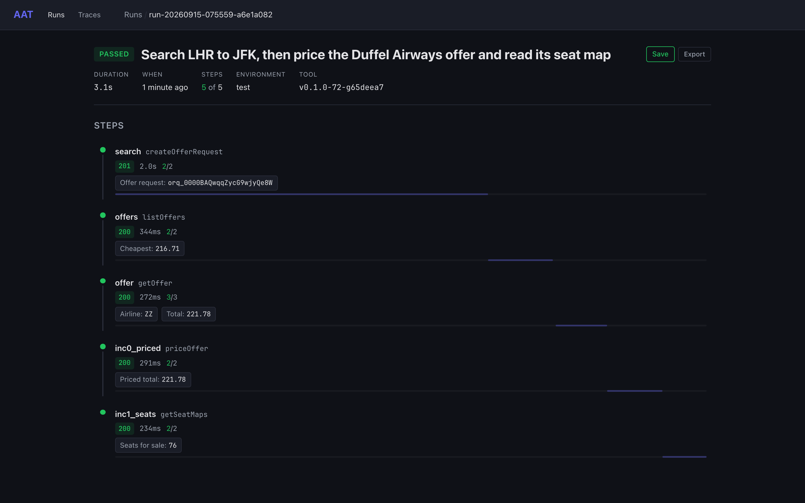

## Three ways to read this project

Three things at once, and they are the same files.

- **A worked Duffel integration.** Each node names a Duffel endpoint, the inputs it takes, and the outputs worth
  keeping; the templates are the exact requests. Duffel publishes no OpenAPI spec, so this graph is the
  machine-readable description of the API, and every claim in it has a run behind it.
- **A test suite Duffel's API could be run against.** 47 plans cover places, search, offers, booking, changes,
  cancellation, and the account, each asserting what the API answered. Point it at any test-mode token and it says
  what changed.
- **A demonstration of AAT.** Workflows with slots, five layer axes crossed into a matrix, cleanup that cancels every
  order, `repeat` for batch searches, and visualizers drawn from real responses. See
  [AAT features on display](#aat-features-on-display).

It is one of three such projects, with [aat-stripe](https://github.com/gburgyan/aat-stripe) and
[aat-shippo](https://github.com/gburgyan/aat-shippo); [Real APIs](https://gburgyan.github.io/aat/examples/real-apis/)
compares them.

## Getting started

### What you need

- **AAT v0.2.0 or later.** Install it with Homebrew, a release archive, Docker, or `go install` — see
  [Install](https://gburgyan.github.io/aat/install/):

  ```bash
  brew install gburgyan/tap/aat
  ```

  A `go install` build has every CLI feature but no web UI, so the `aat web` views below need a release build or
  Homebrew.

- **A Duffel test-mode access token**, from your Duffel dashboard. It starts with `duffel_test_`. The environments read
  it from `DUFFEL_ACCESS_TOKEN`, the variable Duffel's own client libraries use:

  ```bash
  export DUFFEL_ACCESS_TOKEN=duffel_test_...
  ```

### Nothing here can book a real flight

Searches check that `live_mode` is false before anything is booked, so a live token stops a plan at its first search.
Every order a plan books carries `metadata.source: aat-duffel` and is cancelled in cleanup, and the last plan in a
batch checks that none is left. Groups and webhooks are deleted too, but Duffel offers no way to delete a customer
user or an airline credit, so a full batch leaves two of each on the test account.

A webhook's signing secret, a component client key, and a Links session URL are credentials. No output holds them,
so they never print or reach a display, but the raw responses stay in the run archives under `_output/`, which git
ignores.

### Run it

```bash
aat validate --strict            # check every file, template, workflow, and plan; no requests sent
aat run plan search/one-way      # the run above
aat run plan booking/instant-family-seats-bags   # book a family of four with seats and bags, then cancel it
aat run plan after-booking/cancel-after-change   # book, change to premium economy, cancel, and check the refund
aat run plan account/webhooks    # a webhook's whole life, its failed ping still recorded as a delivery
aat run batch                    # all 47 plans, about three and a half minutes; sequential, so the order guard runs last
aat run batch scenarios          # only Duffel's test routes
aat web view latest              # open the last run in the browser
```

A few ways to read a run without the browser:

```bash
aat run show latest                                   # every step: status, timing, assertions
aat run show latest --step offer --outputs            # what a step extracted
aat run show latest --step offer --response --path data.conditions
```

Long batches can use `--env test-ci`, which spaces requests 250 ms apart. Duffel allows 4000 requests a minute per
token, but only 30 searches (`POST /air/offer_requests`), refused beyond that with 429 `rate_limit_exceeded` until the
minute resets. Find Offer and Book Flight retry a refused search after the reset, so run one batch at a time: several
at once, or `--parallel`, only waits longer.

### Environments

| Environment | What it does |
|---|---|
| `test` (default) | Duffel's test mode, with contact details from the ranges reserved for fiction |
| `test-ci` | `test`, with request starts at least 250 ms apart, for long batches under Duffel's 30 searches a minute |

## Point your coding assistant at it

The same files are an MCP server. [`.mcp.json`](.mcp.json) registers two, and Claude Code loads them when it opens
this directory; other clients take the same commands:

- **`duffel-api`** (`aat mcp serve --persona api`): read-only tools that hand an assistant each operation's exact
  request, the order calls go in, what each needs from the calls before it, the domain's rules, and sample responses
  from real runs. Ask it for a client in your language and it has the whole workflow to work from, not a pile of
  endpoint reference.
- **`duffel-test`** (`--persona test`): the tools to write, validate, run, and debug plans against your own test
  account, with `DUFFEL_ACCESS_TOKEN` in the environment.

[MCP server](https://gburgyan.github.io/aat/mcp-server/) covers the tools, other clients, and the HTTP transport.

## See it in the web UI

`aat web view latest` opens a run as a timeline of its steps. A step's page shows its request, response, extracted
outputs, assertions, and how each input was resolved. Some steps also get a tab that draws their response, from
[`visualizers/`](visualizers/):

| Tab | Shown on | What it draws |
|---|---|---|
| **Offers** | `listOffers` | Every offer on the page, cheapest first: airline, journey, stops and duration, cabin and fare brand, whether it can be held, and the total. The airline chips show how many offers each airline sent, and Duffel Airways rows are highlighted. |
| **Seat map** | any response shaped like a seat map | Each segment's cabin, row by row: seats for sale, seats for sale with a disclosure such as "Passenger must be an adult", seats not for sale, exits, and facilities |
| **Offers in this batch** | a batch search's read | The offers that read brought, and how many batches are left |
| **Order** | any response with a booking reference | The order's state (paid, awaiting payment by its deadline, or cancelled) and totals, the itinerary with each flight's cabin and seats, passengers with their type and loyalty accounts, services, changes, the cancellation's refund, and the actions the order allows |
| **Change offers** | a change request, and `listOrderChangeOffers` | Every change offer in a grid, departure times against cabins: what the change costs, its penalty, and the order's new total. Every cabin has a column, so one the airline doesn't offer shows "no offer". |

Run `aat run plan search/one-way` and open it. The `offers` step lists what the search found. With direct flights
only, this run found 73 offers from 7 airlines:

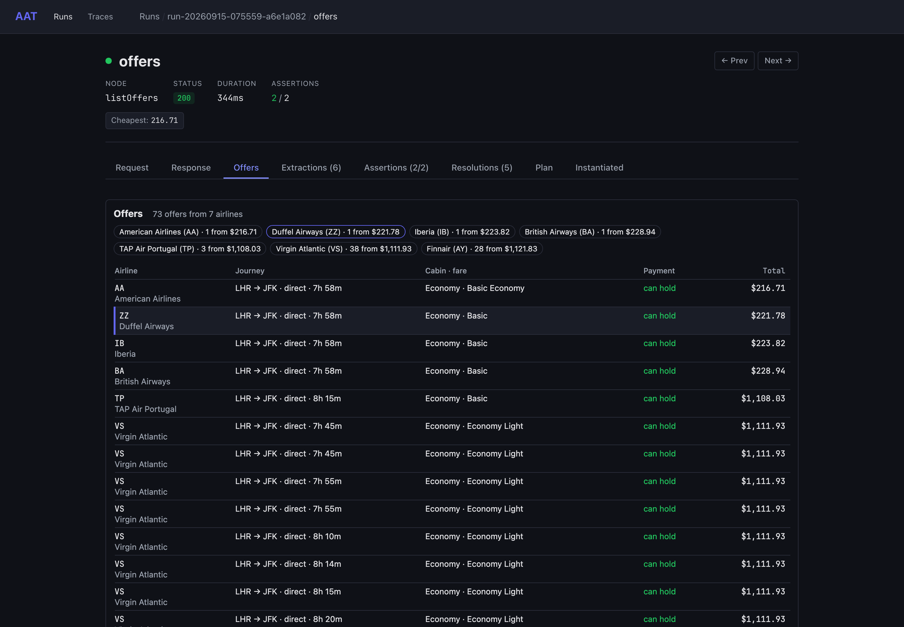

The `inc1_seats` step draws the Duffel Airways offer's cabin:

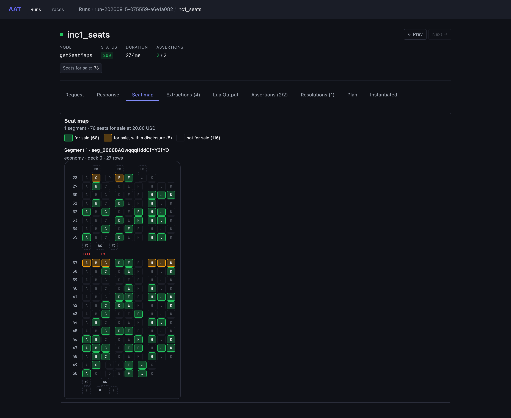

A batch search shows AAT's `repeat`. Run `aat run plan search/batch`: the `batches` step reads the search again until
no batches remain. Its tab draws the last read, and `aat run show latest --step batches` says how many reads it took
and why it stopped, as in `3 requests (stopped: until)`:

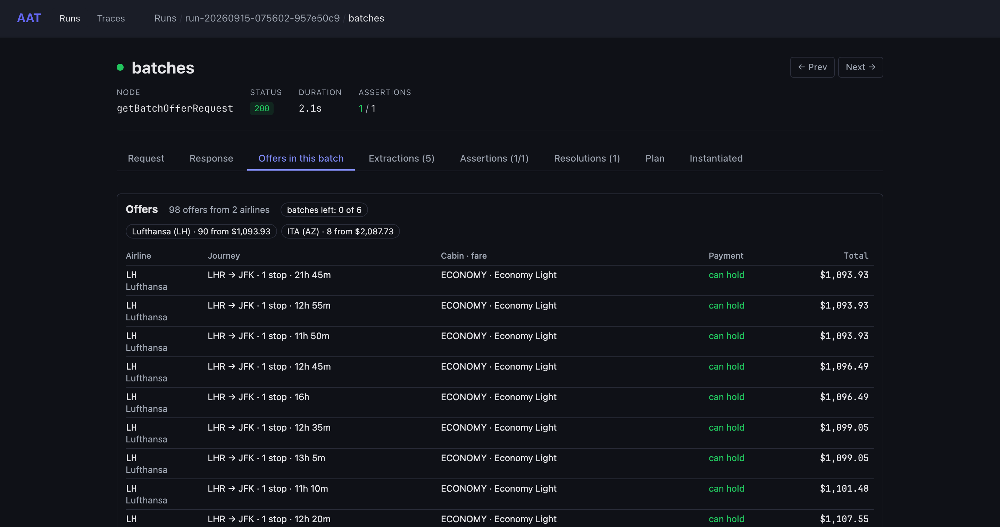

A booking step gets an Order tab. Run `aat run plan booking/instant-family-seats-bags` and pick the `book` step:

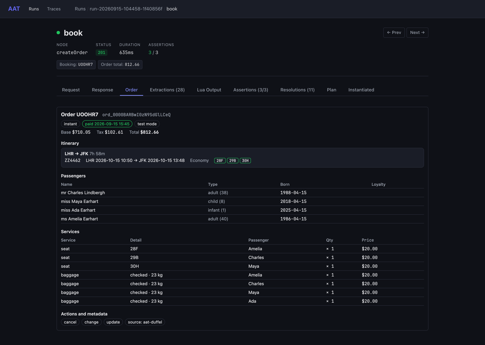

A change request gets a Change offers tab. Run `aat run plan after-booking/change-premium-economy` and pick the
`inc2_changeRequest` step. The plan asked for premium economy, and the grid shows why a plan has to say which offer it
wants: nine offers at the same price, and nothing in business:

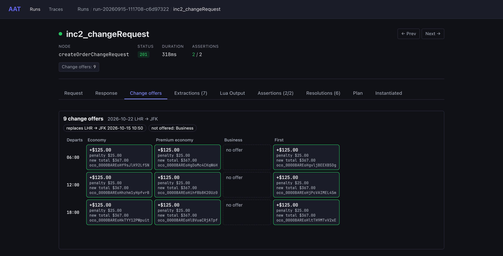

The visualizers are plain HTML files that receive the response body from the web UI. Matching is declared in
[`visualizers/visualizers.yaml`](visualizers/visualizers.yaml). Every Duffel response is wrapped in `{"data": …}`, so
the seat map matches on a nested path rather than a node name:

```yaml
- id: seat-map
  name: Seat map
  file: seat-map.html
  match:
    bodyPath: data.0.cabins
```

## How the plans fit together

Most plans that search reuse one workflow, [Find Offer](workflows/find-offer.yaml). It searches, lists the offers
cheapest first, and picks the Duffel Airways offer, never the first or the cheapest. Addons extend it:

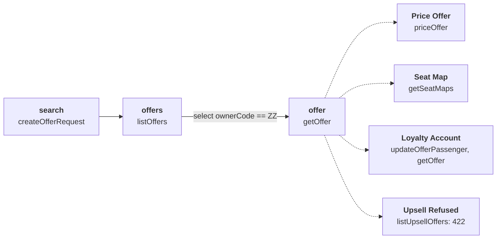

A plan that reuses the workflow is a recipe. It picks addons and overrides values and assertions, and AAT composes
the full plan when it runs. Here is the whole of the connecting-flights scenario:

```yaml
kind: recipe
metadata:
  prompt: Search Duffel's multi-segment test route
  graphVersion: "1.0.0"
selection:
  workflow: Find Offer
  description: The Duffel Airways offer's first slice has two flights
overrides:
  values:
    search.origin: LHR
    search.destination: DXB
  assertions:
    offer:
      - type: predicate
        expr: firstSliceSegmentCount == 2
```

A batch search can't be a single read, since its offers arrive a supplier at a time. The [batch plan](plans/search/batch.yaml)
repeats the read until nothing remains, gathering outputs from every response:

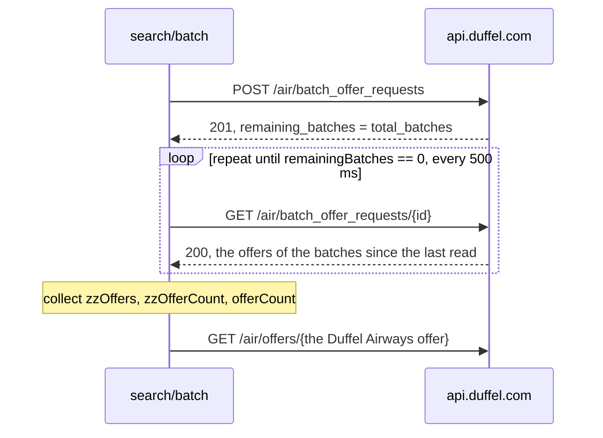

```yaml
- id: batches
  node: getBatchOfferRequest
  values:
    batchOfferRequestId: {from: start.batchOfferRequestId}
  repeat:
    until: remainingBatches == 0
    collect: [zzOffers, zzOfferCount, offerCount]
    interval: 500ms
    max: 30
    timeout: 50s
  assertions:
    mechanical:
      - type: predicate
        expr: zzOfferCount >= 1 && offerCount > zzOfferCount
```

Booking plans reuse [Book Flight](workflows/book-flight.yaml). Its `payment` slot picks how the order is paid, addons
add seats, bags, a loyalty account, or a metadata update, and [party layers](layers/) set the passengers. The priced
services go into the order as they are, so an instant order pays exactly the priced total:

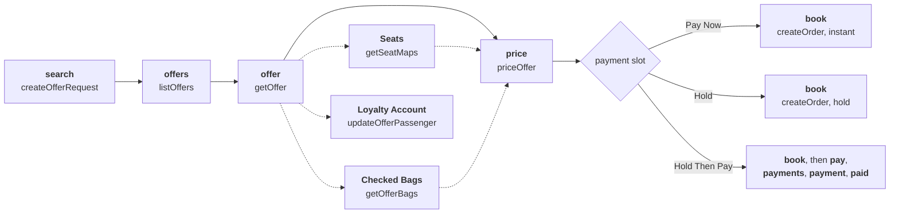

Here is the whole of the family booking:

```yaml
kind: recipe
selection:
  workflow: Book Flight
  choices:
    payment: Pay Now
  addons: [Seats, Checked Bags]
  layers: [party-family]
overrides:
  assertions:
    book:
      - type: predicate
        expr: >-
          passengerCount == 4 && adultCount == 2 && childCount == 1 && infantCount == 1 &&
          seatCount >= 3 && bagCount >= 3
```

Every order is cancelled when its plan ends. `createOrder`'s cleanup quotes a cancellation, and that quote's cleanup
confirms it:

```yaml
createOrder:
  cleanup:
    node: createOrderCancellation
    when: cancellable == true
createOrderCancellation:
  cleanup: confirmOrderCancellation
```

`aat run show <batch>` sums up what cleanup did. In the last full batch, cleanup quoted 17 cancellations and confirmed
18 (one of them a quote a plan left unconfirmed), with 0 failures. Five plans cancelled their orders themselves, and
the account plans deleted their group and webhook, so those entries show as released. Then
[`zz-no-live-orders`](plans/zz-no-live-orders.yaml), which sorts last, reads every page of the account's orders and
fails if one of the project's orders is still active:

```yaml
- id: orders
  node: listOrders
  values:
    limit: 200
  repeat:
    next: {after: nextCursor}
    collect: [orderCount, ourOrderCount, ourActiveOrderCount, ourActiveOrders, otherActiveOrderCount, liveModeOrderCount]
    max: 100
  assertions:
    mechanical:
      - type: predicate
        expr: orderCount > 0 && ourOrderCount > 0 && ourActiveOrderCount == 0 && liveModeOrderCount == 0
```

Orders from other sources on the same account are counted apart and never fail it.

A plan that cancels the order itself leaves cleanup nothing to do. Its quote names the same order, so it releases
`createOrder`'s entry, and its confirmation releases the quote's. `aat run show` lists both as
`skipped: released by`. A quote left unconfirmed is still confirmed by its own cleanup, as
[cancel-quote-then-cleanup](plans/after-booking/cancel-quote-then-cleanup.yaml) shows.

After-booking addons insert after `book`, or after `pay` in Hold Then Pay. Addons at the same place chain in order,
and Cancel Order has `priority: 10`, so it always comes last:

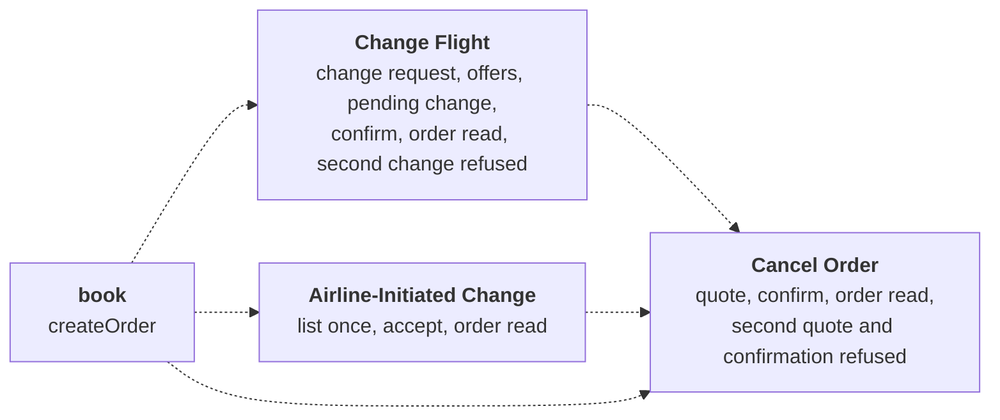

Here is the whole of the plan that changes an order and then cancels it:

```yaml
kind: recipe
selection:
  workflow: Book Flight
  choices:
    payment: Pay Now
  addons: [Change Flight, Cancel Order]
  layers: [party-solo]
overrides:
  assertions:
    inc1_quote:
      - type: predicate
        expr: 'refundAmount == "{{inc0_afterChange.totalAmount}}" && refundTo == "balance"'
    inc1_cancelled:
      - type: predicate
        expr: 'confirmedChangeCount == 1 && totalBeforeChanges == "{{book.totalAmount}}"'
```

AAT prefixes each addon's steps with its place in the list, `inc0_` for Change Flight and `inc1_` for Cancel Order,
so a recipe names them that way. The assertions compare one step's output with another's: the refund is the total
after the change, and the total less the change is what was booked.

Duffel Airways offers nine changes at the same price, so the cheapest isn't a choice. Change Flight names the cabin
and the time, and stops the plan if two offers still match:

```yaml
- id: changeOffer
  node: getOrderChangeOffer
  values:
    orderChangeOfferId:
      from: changeRequest.changeOffers
      select:
        strategy: min
        field: id
        sortField: changeTotalAmount
        filter: cabinClass == "premium_economy" && departureTime == "18:00"
        onTie: fail
```

## Layers and matrix runs

A layer fills inputs a plan leaves unset. The project's layers vary the search on five axes. Every one sets an input of
`createOfferRequest`, so a change request keeps its own cabin and date.

| Layers | Input | Values (and without the layer) |
|---|---|---|
| `area-europe`, `area-us-domestic`, `area-asia-pacific` | `origin`, `destination` | LGW → BCN, JFK → LAX, SYD → SIN (LHR → JFK) |
| `cabin-premium-economy`, `cabin-business`, `cabin-first` | `cabinClass` | the cabin each names (economy) |
| `depart-in-2-days`, `depart-next-week`, `depart-in-6-months` | `departureDate` | `{{today + 2 days}}`, `+ 7 days`, `+ 180 days` (`+ 30 days`) |
| `round-trip` | `returnDate` | `{{departureDate + 7 days}}`, a week after whatever departure date the search ends up with (one-way) |
| `party-solo`, `party-couple`, `party-trio`, `party-family` | `passengerAges` | `[35]`, `[35, 33]`, `[35, 8, 1]`, `[40, 38, 8, 1]` (`[35]`) |

The nearest departure is two days out, not one, because `today` is the date where AAT runs, which can already be
tomorrow at the airport.

There's no layer for how an order is paid. Duffel's ways of paying are paying at once, holding, and holding then paying.
They differ in their steps, not in an input, so they're Book Flight's `payment` slot, and a layer can't pick a slot.
This account also pays only from its balance: cards and 3-D Secure answer 403. So [`plans/matrix/`](plans/matrix/) has
one plan per way of paying, plus a search with no order, and none of them sets anything a layer sets. Crossed with layer
groups, each plan is a row and each combination of layers a column.

Every cell proves its layers took effect. Find Offer and Book Flight compare the offer with the search, and each payment
slot compares the order as it's booked:

```yaml
- type: predicate
  expr: >-
    firstSliceOrigin == "{{search.firstSliceOrigin}}" && firstSliceDestination == "{{search.firstSliceDestination}}" &&
    firstSliceDepartureDate == "{{search.firstSliceDepartureDate}}" &&
    secondSliceDepartureDate == "{{search.secondSliceDepartureDate}}" && sliceCount == "{{search.sliceCount}}" &&
    passengerCount == "{{search.passengerCount}}" && cabinClasses == "{{search.cabinClass}}"
```

`cabinClasses` is the cabin of every flight, so a business search that came back with an economy return would fail.

Each `--layer-group` adds its layers and "none", and the groups are crossed:

```bash
# Search only, no orders: 4 area choices × 4 cabins × 4 lead times
aat run batch matrix/find-offer --env test-ci \
  --layer-group area-europe,area-us-domestic,area-asia-pacific \
  --layer-group cabin-premium-economy,cabin-business,cabin-first \
  --layer-group depart-in-2-days,depart-next-week,depart-in-6-months

# Every way of paying, by party and cabin
aat run batch matrix --env test-ci \
  --layer-group party-solo,party-couple,party-trio,party-family \
  --layer-group cabin-premium-economy,cabin-business,cabin-first

# Every way of paying, by lead time, one-way and round trip
aat run batch matrix --env test-ci \
  --layer-group depart-in-2-days,depart-next-week,depart-in-6-months \
  --layer-group round-trip

aat run plan zz-no-live-orders   # after a batch that books, check that no order is left
```

Run one batch at a time, every cell passed:

| Batch | Runs | Result | Time |
|---|---|---|---|
| Search: area × cabin × lead time | 1 plan × 64 | 64 passed | 136 s |
| Ways of paying × party × cabin | 4 plans × 20 | 64 passed, 16 skipped | 285 s |
| Ways of paying × lead time × round trip | 4 plans × 8 | 32 passed | 182 s |

The 16 skips are dedup at work. `party-solo` sets the ages the graph already defaults to, so each of its combinations
builds the same plan as the combination without it, and AAT runs that plan once:

```text
aat: dedup — 16 duplicate permutations detected:
  matrix/find-offer [cabin-business, party-solo] → duplicate of matrix/find-offer [cabin-business]
  matrix/find-offer [cabin-first, party-solo] → duplicate of matrix/find-offer [cabin-first]
  matrix/find-offer [cabin-premium-economy, party-solo] → duplicate of matrix/find-offer [cabin-premium-economy]
  matrix/find-offer [party-solo] → duplicate of matrix/find-offer [(base)]
  …
```

The two booking batches cancelled all 72 orders they made, with 0 cleanup failures, and `zz-no-live-orders` passed
after them. What the Duffel Airways offer cost for one adult, one way, a month out, in that search batch:

| Area | Economy | Premium economy | Business | First |
|---|---|---|---|---|
| LHR → JFK | 223.32 | 347.45 | 1364.96 | 3230.44 |
| LGW → BCN | 70.32 | 92.21 | 294.29 | 695.43 |
| JFK → LAX | 166.54 | 256.21 | 979.27 | 2304.58 |
| SYD → SIN | 258.21 | 383.83 | 1474.99 | 3921.31 |

A batch's By Test view in the web UI draws the matrix: a row per plan, a column per combination of layers, and a filter
for each group. Here is the second batch, with its skipped cells shown:

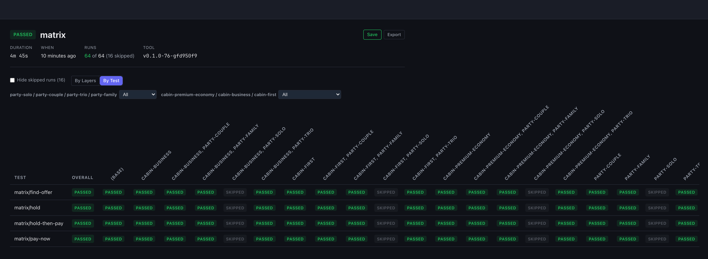

Run layer groups on `plans/matrix/` only. The other plans pin what they prove to a route, a cabin, or a party. Change
Flight expects Duffel Airways' nine change offers on LHR → JFK, for example, and a booking recipe asserts the
passengers of the party it names, so a layer that changes those fails them by design.

## What's exercised

### Operations

Each endpoint is a node in [`graph.yaml`](graph.yaml), with a template in [`templates/`](templates/). Every node runs in
at least one plan, the cancellation nodes in cleanup.

| Operation | Node | Proven by |
|---|---|---|
| `GET /places/suggestions` | `suggestPlaces` | [places](plans/reference/places.yaml), [airports-and-cities](plans/reference/airports-and-cities.yaml) |
| `GET /air/airports`, `GET /air/airports/{id}` | `listAirports`, `getAirport` | [airports-and-cities](plans/reference/airports-and-cities.yaml) |
| `GET /air/cities`, `GET /air/cities/{id}` | `listCities`, `getCity` | [airports-and-cities](plans/reference/airports-and-cities.yaml) |
| `GET /air/airlines`, `GET /air/airlines/{id}` | `listAirlines`, `getAirline` | [airlines-aircraft-loyalty](plans/reference/airlines-aircraft-loyalty.yaml) |
| `GET /air/aircraft`, `GET /air/aircraft/{id}` | `listAircraft`, `getAircraft` | [airlines-aircraft-loyalty](plans/reference/airlines-aircraft-loyalty.yaml) |
| `GET /air/loyalty_programmes`, `GET /air/loyalty_programmes/{id}` | `listLoyaltyProgrammes`, `getLoyaltyProgramme` | [airlines-aircraft-loyalty](plans/reference/airlines-aircraft-loyalty.yaml) |
| `POST /air/offer_requests` | `createOfferRequest` | Find Offer, [journey-shapes](plans/search/journey-shapes.yaml), [offer-requests](plans/search/offer-requests.yaml), three scenarios |
| `GET /air/offer_requests/{id}`, `GET /air/offer_requests` | `getOfferRequest`, `listOfferRequests` | [offer-requests](plans/search/offer-requests.yaml) |
| `GET /air/offers` | `listOffers` | Find Offer, [no-offers](plans/scenarios/no-offers.yaml), [offer-gone](plans/scenarios/offer-gone.yaml) |
| `GET /air/offers/{id}` | `getOffer` | Find Offer, [batch](plans/search/batch.yaml), [offer-gone](plans/scenarios/offer-gone.yaml) |
| `POST /air/offers/{id}/actions/price` | `priceOffer` | [one-way](plans/search/one-way.yaml), Book Flight |
| `GET /air/seat_maps` | `getSeatMaps` | [one-way](plans/search/one-way.yaml), [instant-family-seats-bags](plans/booking/instant-family-seats-bags.yaml), [hold-then-pay-trio-seats](plans/booking/hold-then-pay-trio-seats.yaml) |
| `GET /air/offers/{id}?return_available_services=true` | `getOfferBags` | [instant-family-seats-bags](plans/booking/instant-family-seats-bags.yaml) |
| `PATCH /air/offers/{offer_id}/passengers/{id}` | `updateOfferPassenger` | [loyalty](plans/search/loyalty.yaml) |
| `POST /air/offers/{id}/upsell_offers` | `listUpsellOffers` | [upsell](plans/search/upsell.yaml) |
| `POST /air/batch_offer_requests`, `GET /air/batch_offer_requests/{id}` | `createBatchOfferRequest`, `getBatchOfferRequest` | [batch](plans/search/batch.yaml) |
| `POST /air/orders` | `createOrder` | Book Flight: the [booking plans](plans/booking/) and the order-side scenarios |
| `GET /air/orders/{id}`, `PATCH /air/orders/{id}` | `getOrder`, `updateOrder` | Book Flight, [metadata](plans/booking/metadata.yaml) |
| `GET /air/orders` | `listOrders` | [zz-no-live-orders](plans/zz-no-live-orders.yaml), [metadata](plans/booking/metadata.yaml), [order-for-customer-user](plans/account/order-for-customer-user.yaml), the order-side scenarios |
| `POST /air/payments`, `GET /air/payments`, `GET /air/payments/{id}` | `createPayment`, `listPayments`, `getPayment` | [hold-then-pay-trio-seats](plans/booking/hold-then-pay-trio-seats.yaml), [airline-credits](plans/after-booking/airline-credits.yaml) |
| `POST /air/order_cancellations`, `POST /air/order_cancellations/{id}/actions/confirm` | `createOrderCancellation`, `confirmOrderCancellation` | cleanup after every booking, Cancel Order, [cancel-quote-then-cleanup](plans/after-booking/cancel-quote-then-cleanup.yaml) |
| `GET /air/order_cancellations/{id}`, `GET /air/order_cancellations` | `getOrderCancellation`, `listOrderCancellations` | Cancel Order: the [cancel plans](plans/after-booking/) |
| `POST /air/order_change_requests`, `GET /air/order_change_requests/{id}` | `createOrderChangeRequest`, `getOrderChangeRequest` | Change Flight, [change-business-not-offered](plans/after-booking/change-business-not-offered.yaml) |
| `GET /air/order_change_offers`, `GET /air/order_change_offers/{id}` | `listOrderChangeOffers`, `getOrderChangeOffer` | Change Flight, [change-business-not-offered](plans/after-booking/change-business-not-offered.yaml) |
| `POST /air/order_changes`, `GET /air/order_changes/{id}`, `POST /air/order_changes/{id}/actions/confirm` | `createOrderChange`, `getOrderChange`, `confirmOrderChange` | Change Flight: [change-premium-economy](plans/after-booking/change-premium-economy.yaml), [change-round-trip-keeps-return-seats](plans/after-booking/change-round-trip-keeps-return-seats.yaml), [cancel-after-change](plans/after-booking/cancel-after-change.yaml) |
| `GET /air/orders/{id}/available_services`, `POST /air/orders/{id}/services` | `listOrderAvailableServices`, `addOrderServices` | [services-after-booking](plans/after-booking/services-after-booking.yaml), [services-after-hold](plans/after-booking/services-after-hold.yaml) |
| `GET /air/airline_initiated_changes`, `POST /air/airline_initiated_changes/{id}/actions/accept` | `listAirlineInitiatedChanges`, `acceptAirlineInitiatedChange` | [airline-initiated-change](plans/after-booking/airline-initiated-change.yaml) |
| `POST /air/airline_credits`, `GET /air/airline_credits/{id}`, `GET /air/airline_credits` | `createAirlineCredit`, `getAirlineCredit`, `listAirlineCredits` | [airline-credits](plans/after-booking/airline-credits.yaml) |
| `POST /identity/customer/users`, `GET /identity/customer/users/{id}`, `PUT /identity/customer/users/{id}`, `GET /identity/customer/users` | `createCustomerUser`, `getCustomerUser`, `updateCustomerUser`, `listCustomerUsers` | [customer-users-and-groups](plans/account/customer-users-and-groups.yaml), [order-for-customer-user](plans/account/order-for-customer-user.yaml) |
| `POST /identity/customer/user_groups`, `GET /identity/customer/user_groups/{id}`, `PATCH /identity/customer/user_groups/{id}`, `GET /identity/customer/user_groups`, `DELETE /identity/customer/user_groups/{id}` | `createCustomerUserGroup`, `getCustomerUserGroup`, `updateCustomerUserGroup`, `listCustomerUserGroups`, `deleteCustomerUserGroup` | [customer-users-and-groups](plans/account/customer-users-and-groups.yaml) |
| `POST /identity/component_client_keys` | `createComponentClientKey` | [customer-users-and-groups](plans/account/customer-users-and-groups.yaml), [order-for-customer-user](plans/account/order-for-customer-user.yaml) |
| `POST /links/sessions` | `createLinksSession` | [links-sessions](plans/account/links-sessions.yaml) |
| `POST /air/webhooks`, `GET /air/webhooks`, `PATCH /air/webhooks/{id}`, `DELETE /air/webhooks/{id}`, `POST /air/webhooks/{id}/actions/ping` | `createWebhook`, `listWebhooks`, `updateWebhook`, `deleteWebhook`, `pingWebhook` | [webhooks](plans/account/webhooks.yaml) |
| `GET /air/webhooks/deliveries`, `GET /air/webhooks/events/{id}` | `listWebhookDeliveries`, `getWebhookEvent` | [webhooks](plans/account/webhooks.yaml) |

### Plans

| Plan | What it proves |
|---|---|
| [reference/places](plans/reference/places.yaml) | Heathrow by name is airport LHR in city LON, and a search 20 km around its runways finds it. London is a city that lists its airports. A query that matches nothing is 200 with an empty list. |
| [reference/airports-and-cities](plans/reference/airports-and-cities.yaml) | Two pages of airports joined by their cursor, with the rate-limit headers read as numbers. A page of cities with their airports. Heathrow and London read by the IDs a place lookup returned. |
| [reference/airlines-aircraft-loyalty](plans/reference/airlines-aircraft-loyalty.yaml) | Each list's first entry read back by ID, and a loyalty programme's airline read by the owner ID it names |
| [search/one-way](plans/search/one-way.yaml) | Direct flights from LHR to JFK. The Duffel Airways offer can be held, sells a checked bag, and states change and refund penalties exactly when it allows them. It prices for a balance payment and has seats for sale. |
| [search/journey-shapes](plans/search/journey-shapes.yaml) | One-way, round trip, an open jaw on to LAX, and a family of four in premium economy, with each search's slices and passengers checked |
| [search/offer-requests](plans/search/offer-requests.yaml) | An offer request read back with its offers inlined, and the account's recent offer requests paged |
| [search/loyalty](plans/search/loyalty.yaml) | Duffel's test loyalty account attached to the offer's passenger, and still on the offer when it's read again |
| [search/upsell](plans/search/upsell.yaml) | Duffel Airways refuses upsell offers: 422 `unsupported_action`, an `airline_error` |
| [search/batch](plans/search/batch.yaml) | A batch search polled until no batches remain, with the Duffel Airways offers collected on the way |
| [booking/instant-solo](plans/booking/instant-solo.yaml) | One adult booked and paid at once, at exactly the priced total. The order carries the project's tag and allows cancel, change, and update. |
| [booking/instant-family-seats-bags](plans/booking/instant-family-seats-bags.yaml) | Two adults, a child, and an infant on a lap, with seats and extra bags. The order books exactly the services priced (in one run, 3 seats and 4 bags) and counts each passenger type. |
| [booking/hold-couple](plans/booking/hold-couple.yaml) | Two adults held unpaid at the priced total, with a payment deadline and a price guarantee |
| [booking/hold-then-pay-trio-seats](plans/booking/hold-then-pay-trio-seats.yaml) | An adult, a child, and an infant held with seats, then paid at the held total. The payment reads back, and the paid order's total is unchanged. |
| [booking/loyalty-member](plans/booking/loyalty-member.yaml) | The test loyalty account attached before booking: the order books below the offer's first price and keeps the account |
| [booking/metadata](plans/booking/metadata.yaml) | A reference stored at booking, replaced with PATCH, and the order found again by its booking reference |
| [after-booking/change-premium-economy](plans/after-booking/change-premium-economy.yaml) | An order with a seat and a bag moved to the one premium economy offer at 18:00. The order is in that cabin at that time, its total rose by exactly the change's cost, the old flight's seat and bag are gone, and a second change is 422 `order_not_changeable`. |
| [after-booking/change-round-trip-keeps-return-seats](plans/after-booking/change-round-trip-keeps-return-seats.yaml) | A round trip for two with seats, the outbound changed: seats per flight go from 2 and 2 to 0 and 2 |
| [after-booking/change-business-not-offered](plans/after-booking/change-business-not-offered.yaml) | A change request for business offers none, when it's made, read back, or listed, and the order is left as it was |
| [after-booking/cancel-instant](plans/after-booking/cancel-instant.yaml) | A paid order quoted, read back, listed, and confirmed: the whole total refunded to the balance, the order allowing only update, and a second quote and confirmation both 422 `already_cancelled` |
| [after-booking/cancel-unpaid-hold](plans/after-booking/cancel-unpaid-hold.yaml) | An unpaid hold cancelled with a refund of 0.00 to `awaiting_payment` |
| [after-booking/cancel-after-change](plans/after-booking/cancel-after-change.yaml) | A changed order cancelled: the refund is the total after the change, 125.00 included |
| [after-booking/cancel-quote-then-cleanup](plans/after-booking/cancel-quote-then-cleanup.yaml) | A quote left unconfirmed: the order is still booked when the steps end, and cleanup confirms the quote |
| [after-booking/services-after-booking](plans/after-booking/services-after-booking.yaml) | A paid order lists no services, and adding the bag its offer sold is 400 "Unsupported operation" |
| [after-booking/services-after-hold](plans/after-booking/services-after-hold.yaml) | A held order refuses a bag sent with a payment (422 `pay_later_order_no_payment_for_ancillaries`) and without one (400) |
| [after-booking/airline-initiated-change](plans/after-booking/airline-initiated-change.yaml) | On LHR → LTN, the order's one airline-initiated change is accepted, and the order's flight leaves at a new time |
| [after-booking/cancel-to-airline-credits](plans/after-booking/cancel-to-airline-credits.yaml) | On LTN → SYD, the cancellation refunds the whole total as one airline credit |
| [after-booking/airline-credits](plans/after-booking/airline-credits.yaml) | A credit created, read back unspent, and listed; a payment with it is 422 `validation_inclusion` |
| [account/customer-users-and-groups](plans/account/customer-users-and-groups.yaml) | A user created, read, replaced with PUT, and found by email. A group with the user in it, read, renamed, listed, and shown on the user. Client keys with no claims, for the user, and for an unknown user. The group deleted and then 404, and a second user with the same email 422 `emails_not_unique`. |
| [account/order-for-customer-user](plans/account/order-for-customer-user.yaml) | An order booked for a user names the user, listing orders by `user_id` finds exactly that order, and a client key covers the user and the order |
| [account/links-sessions](plans/account/links-sessions.yaml) | A session with its required fields gets a URL on links.duffel.com, and one without them is 422 with four `validation_required` errors |
| [account/webhooks](plans/account/webhooks.yaml) | A webhook created and listed, a second refused with `unsafe_unique`, and the first deactivated, then reactivated with two events. A failed ping is still recorded as a `ping.triggered` delivery with an event, and the deleted webhook is 404. |
| [matrix/find-offer](plans/matrix/find-offer.yaml) | The Duffel Airways offer for whatever search the layers set, direct only, matching the search's airports, dates, slices, passengers, and cabins |
| [matrix/pay-now](plans/matrix/pay-now.yaml), [matrix/hold](plans/matrix/hold.yaml), [matrix/hold-then-pay](plans/matrix/hold-then-pay.yaml) | One way of paying each, for whatever search the layers set, with the order matching the search as it's booked |
| [zz-no-live-orders](plans/zz-no-live-orders.yaml) | Every page of the account's orders, read with `repeat.next`: none of the project's orders is still active |

### Duffel's test routes

Duffel's test mode simulates situations on fixed one-way routes. Each has a plan, most under
[`plans/scenarios/`](plans/scenarios/), and each plan asserts the outcome, including the error `code` when there is
one.

| Route | Duffel simulates | The plan asserts |
|---|---|---|
| PVD → RAI | no flights | [no-offers](plans/scenarios/no-offers.yaml): the search succeeds, and its offers page is empty |
| JFK → EWR | offers that can only be held | [holdable-offers](plans/scenarios/holdable-offers.yaml): no offer on the page needs instant payment |
| LHR → DXB | connecting flights | [connecting-flights](plans/scenarios/connecting-flights.yaml): the offer's first slice has two flights |
| DXB → AMS | a stop within a flight | [stop-within-segment](plans/scenarios/stop-within-segment.yaml): one flight, with one stop and its airport |
| BTS → MRU | no baggage | [no-baggage](plans/scenarios/no-baggage.yaml): the offer includes no bags |
| BTS → ABV | no extra services | [no-services](plans/scenarios/no-services.yaml): nothing for sale, though the fare still includes bags |
| STN → LHR | a search that times out | [search-timeout](plans/scenarios/search-timeout.yaml): 504 `gateway_timeout_error`, an `api_error` |
| LGW → LHR | an offer gone by the time it's read | [offer-gone](plans/scenarios/offer-gone.yaml): 422 `offer_no_longer_available` |
| LHR → LGW | an order the airline fails | [order-creation-error](plans/scenarios/order-creation-error.yaml): 502 `airline_unknown`, an `airline_error`, and no order |
| LGW → STN | a balance too low to pay | [insufficient-balance](plans/scenarios/insufficient-balance.yaml): 422 `insufficient_balance`, an `invalid_state_error`, and no order |
| LHR → STN | a price that rises with every read | [price-changed-at-booking](plans/scenarios/price-changed-at-booking.yaml): the second read costs more, and paying the first read's total is 422 `payment_amount_does_not_match_order_amount`, with no order |
| LHR → LTN | airline-initiated changes | [airline-initiated-change](plans/after-booking/airline-initiated-change.yaml): one change after one read, accepted, and the flight's time moved |
| LTN → SYD | a refund as airline credits | [cancel-to-airline-credits](plans/after-booking/cancel-to-airline-credits.yaml): the quote refunds to `airline_credits`, with one credit |

## What Duffel does in test mode

These notes come from the runs. They're also in [`domain.yaml`](domain.yaml), where AI tools that read the project
find them.

- **Searches are big.** One adult from LHR to JFK brought 229 offers from many airlines, which would be 1.5 MB inlined
  in the search response. The plans search with `return_offers=false` and page the offers cheapest first.
- **Duffel Airways (ZZ) is the airline to pick.** The other airlines in test mode are sandboxes that don't book
  reliably, so every plan selects the offer whose owner is ZZ.
- **A Duffel Airways offer can always be held**, with payment due a few days later.
- **Change and refund conditions vary between searches.** Twelve fares from LHR to JFK showed all four combinations.
  An allowed change or refund states a 40.00 penalty, and a refused one states none, so the plans check that pairing
  rather than a fixed answer.
- **Extras are sold per passenger.** The offer includes a checked and a carry-on bag, and sells one extra 23 kg bag at
  20.00. Its economy cabin has 192 seats, 76 of them for sale at 20.00.
- **No upsells.** Duffel Airways answers the upsell action with 422 `unsupported_action`.
- **The test loyalty account takes 10% off.** With Amelia Earhart's Duffel Airways account (1234567890) on the
  passenger, 227.33 became 204.60: the two totals in the loyalty plan's output. An order booked afterwards pays the
  member price and keeps the account.
- **Batch searches arrive a supplier at a time.** `remaining_batches` falls unevenly (6, 2, 1, 0 in one run), each
  read returns only the new offers, and Duffel Airways came in the first batch. A batch search expires a minute
  after it starts.
- **Offers expire** about 30 minutes after the search. Every run searches again, so plans never read stale offers
  except on purpose.
- **Lists page with cursors.** `meta.after` is `null` on the last page. Every response carries lowercase
  `ratelimit-*` headers (4000 requests a minute, 30 for searches) and an `x-request-id`.
- **Booking takes the priced total exactly.** An instant order pays from the balance at the price action's total,
  services included, and books exactly the services priced: 20.00 for each Duffel Airways seat and each extra 23 kg
  bag.
- **Birth dates must fit the ages searched.** Duffel checks each one as of the last flight's departure. An infant is
  booked by naming it on an adult as `infant_passenger_id`, and takes no seat. The order's passengers echo neither
  that link nor a passenger type.
- **Holds are due in 72 hours.** A held order's payment deadline is the search's creation time plus 72 hours, and its
  price is guaranteed for 48. Seats and bags can be held too, and paying at the held total leaves the total
  unchanged.
- **Metadata is the only thing an order update changes.** PATCH replaces it, and the `booking_reference` and
  `offer_id` list filters find the order again.
- **Refused orders leave nothing behind.** On each order-side test route, listing orders by the offer finds none.
- **Every change costs the same.** A change request on an LHR to JFK order offers nine changes: economy, premium
  economy, and first, at 06:00, 12:00, and 18:00, each 125.00 with a 25.00 penalty. Business isn't offered even when
  asked for. Confirming one adds exactly 125.00 to the order's total. In the runs, each offer's `new_total_amount`
  was the old total plus 100.00, leaving out the penalty; no plan asserts that.
- **A change drops the replaced flight's extras.** The seat and bag bought for the old flight are gone, while a round
  trip keeps the return flight's seats. A changed order allows only cancel and update, and a second change request
  is 422 `order_not_changeable`.
- **Cancelling refunds what was paid.** A paid order gets its whole total back to the balance, a confirmed change's
  125.00 included, and an unpaid hold gets 0.00 to `awaiting_payment`. A cancelled order allows only update, and a
  second quote or confirmation is 422 `already_cancelled`. In the runs a quote expired an hour after it was made, and
  in one run an order with a change left pending cancelled normally, refunding the total before the change; no plan
  asserts either.
- **Services are sold only with the order.** A booked order, paid or held, lists no services, and adding the bag its
  offer sold is 400 "Unsupported operation", whose `code` is the number 400. A held order refuses a payment sent with
  a service first, with 422 `pay_later_order_no_payment_for_ancillaries`.
- **Looking creates airline-initiated changes.** On LHR to LTN, every read of an order's changes adds one, moving the
  flight an hour later in the runs, and the order shows the new time at once. Only the latest change can be accepted:
  accepting an older one was 422 `stale_airline_initiated_change_accept` in a run. The plan reads once and accepts,
  and the order still cancels normally.
- **Airline credits can't pay and can't be deleted.** LTN to SYD refunds a cancellation as one credit for the whole
  total. `POST /air/airline_credits` makes a credit when its code is a 13-digit ticket number (letters were 422
  `validation_format`), but `POST /air/payments` takes only balance and card, so spending it is 422
  `validation_inclusion`. Duffel's API reference lists no way to delete a credit, so every full batch leaves two on
  the account.
- **Customer users can't be deleted either.** A user (`icu_`) is replaced whole with PUT, and the email filter finds
  it. A second user with the same email is 422 `emails_not_unique`. Every full batch leaves two users on the account.
- **Groups hold users and delete cleanly.** A group (`usg_`) takes its members as `user_ids`, and a member shows the
  group. PATCH renames it, DELETE answers 204, and reading it afterwards is 404 `not_found`.
- **Orders can name a customer user.** An order booked with `users` names that user, and the `user_id` list filter
  finds exactly that order.
- **Component client keys don't check their claims.** A key comes back as a three-part JWT with no claims, for a user,
  for a user and an order, and for a user that doesn't exist.
- **A Links session answers with a URL and nothing else.** The URL is on links.duffel.com, with the session token in
  its query string. Without `reference` and the three redirect URLs, a session is 422 with a `validation_required`
  error for each.
- **One webhook per mode, and a ping needs a receiver.** A second webhook is 422 `unsafe_unique`, and the signing
  secret comes back only when a webhook is created. With nothing behind the URL, a ping is 422
  `webhook_client_error`, yet Duffel records the delivery: a `ping.triggered` event with the status the URL answered
  (405 from example.com in the runs). A deleted webhook is 404 to update. Redelivering the event answered 500
  `internal_server_error` in a run, so no plan does it.
- **Short notice and far ahead.** In the runs, Duffel Airways sold LHR to JFK from one day to 360 days out. A hold
  departing the next day was still due 72 hours after the search, after the flight had left, with its price
  guaranteed for 48 hours. No plan asserts that.

## AAT features on display

| Feature | In this project |
|---|---|
| Workflows, addons, and recipes | [Find Offer](workflows/find-offer.yaml), [Book Flight](workflows/book-flight.yaml), and their [addons](workflows/addons/). Most plans are short recipes that reuse them. |
| Slots and layers | Book Flight's `payment` slot picks Pay Now, Hold, or Hold Then Pay, and [layers](layers/) set a search's area, cabin, lead time, journey, and party |
| Relative dates in layers | `departureDate: "{{today + 2 days}}"`, and `returnDate: "{{departureDate + 7 days}}"`, which follows whatever departure date another layer sets |
| Layer groups and dedup | `--layer-group` crosses [`plans/matrix/`](plans/matrix/) with every combination of layers, and `party-solo`, which equals the default, is skipped as a duplicate |
| Step retries | The search step retries a 429, which waits for Duffel's `ratelimit-reset` |
| Cleanup chains | `createOrder` → `createOrderCancellation` → `confirmOrderCancellation`, with `when: cancellable == true`. A plan's own quote and confirmation release the entries, and `aat run show <batch>` sums up every cleanup |
| Addon order | Change Flight, Airline-Initiated Change, and Cancel Order all insert after the booking; `priority: 10` keeps Cancel Order last |
| Paging with `repeat.next` | [`zz-no-live-orders`](plans/zz-no-live-orders.yaml) reads every page of the account's orders, and fails if a listing is cut off |
| Assertions across steps | `cabinClasses == "{{search.cabinClass}}"` on every offer and order, `serviceCount == "{{price.intendedServiceCount}}"` in the Pay Now slot, `totalBeforeChanges == "{{book.totalAmount}}"` after a change, and `refundAmount == "{{inc0_afterChange.totalAmount}}"` in [cancel-after-change](plans/after-booking/cancel-after-change.yaml) |
| Selection by filter | `select: {strategy: match, field: id, filter: ownerCode == "ZZ"}` picks the offer in Find Offer, and Change Flight picks a change offer by cabin and time with `onTie: fail` |
| Repeating a read until a condition holds | [`search/batch`](plans/search/batch.yaml): `repeat` with `until`, `collect`, `interval`, `max`, and `timeout` |
| Expected failures, checked by error code | [`search-timeout`](plans/scenarios/search-timeout.yaml), [`offer-gone`](plans/scenarios/offer-gone.yaml), the three order-side routes, and [Upsell Refused](workflows/addons/upsell-refused.yaml) |
| Response headers as typed outputs | [`listAirports`](templates/listAirports.yaml) reads `ratelimit-limit` and `ratelimit-remaining`, and a plan compares them |
| Secrets kept out of outputs | A webhook's signing secret, a component client key, and a Links session URL never become outputs: their transforms report only `secretIssued`, `keyIssued`, and `urlHost` |
| gjson in extract rules | Counts (`data.slices.#`), queries (`data.offers.#(owner.iata_code=="ZZ")#`), and defaults (`nextCursor: {path: meta.after, default: ""}`) |
| Conditional and iteration blocks | [`createOfferRequest`](templates/createOfferRequest.yaml) adds a return or onward slice only when asked, and writes one passenger per age |
| Lists and date expressions in step values | `passengerAges: [40, 38, 8, 1]` and `departureDate: "{{today + 30 days}}"` in [`journey-shapes`](plans/search/journey-shapes.yaml) |
| Lua, where a transform earns its place | [`getSeatMaps`](templates/getSeatMaps.yaml) flattens each seat map's cabins, rows, and sections into one entry per seat per passenger |
| `display:` outputs | The offer request, cheapest total, airline, priced total, and seats for sale print under each step |
| Visualizers | [`visualizers/`](visualizers/): the offers table, the seat map, the order, and the change offers grid, matched by node and by `bodyPath` |
| Environments | [`env.yaml`](env.yaml): `test`, and `test-ci`, which extends it and paces requests |
| Domain knowledge | [`domain.yaml`](domain.yaml): what the plans proved, as concepts for AI tools |
| Strict validation | `aat validate --strict` checks every file, template input, workflow, and plan without calling Duffel |

## Not covered yet

- **Not in a plan yet:** recording an action taken elsewhere on an airline-initiated change (PATCH), cancelling an
  order with a change left pending, and redelivering a webhook event, which answered 500 in a run
- **Needs Duffel to enable it:** on the account this project was built against, Stays and Cars answer 403, and cards
  and 3-D Secure answer 403 `unavailable_feature`, so the order-side test routes that pay by card (LTN → STN,
  SEN → STN, and LCY → STN) aren't covered
- **Left out, per Duffel's docs:** partial offer requests (deprecated), Payment Intents and Refunds (closed to new
  customers), ARC/BSP cash payments, and private fares (no test codes)

## Repository layout

```text
aat-project.yaml    the manifest: where everything is, and the default environment
env.yaml            test and test-ci: api.duffel.com, Duffel-Version v2, the token from DUFFEL_ACCESS_TOKEN
graph.yaml          66 nodes: each endpoint's inputs and outputs, and what Duffel does
templates/          one request and response template per node
domain.yaml         what the plans proved about Duffel, as concepts
workflows/          Find Offer, Book Flight with its payment slots, and their addons
layers/             travel areas, cabins, lead times, a round trip, and parties of one to four
plans/reference/    places, airports, cities, airlines, aircraft, and loyalty programmes
plans/search/       searches, offers, pricing, seat maps, loyalty, upsells, and batch search
plans/booking/      orders paid at once or held, with seats, bags, loyalty, and metadata
plans/after-booking/  changes, cancellations, services, airline-initiated changes, and airline credits
plans/account/      customer users and groups, component client keys, Links sessions, and webhooks
plans/matrix/       one plan per way of paying, plus a search, to run with layer groups
plans/scenarios/    Duffel's test routes, search and order side
plans/zz-no-live-orders.yaml   the guard that no order the project booked is left active
visualizers/        the Offers, Seat map, Order, and Change offers tabs for the web UI
docs/api/           generated from the graph: a page per node, and a diagram of the wiring
docs/images/        the screenshots in this README
```

Run output goes to `_output/`, which git ignores, along with one-off `probes/`, `setup-*.sh`, `env.secrets*.yaml`, and
`.env`, so a token kept in one of those never reaches the repository.

## License

Apache 2.0; see [LICENSE](LICENSE).
