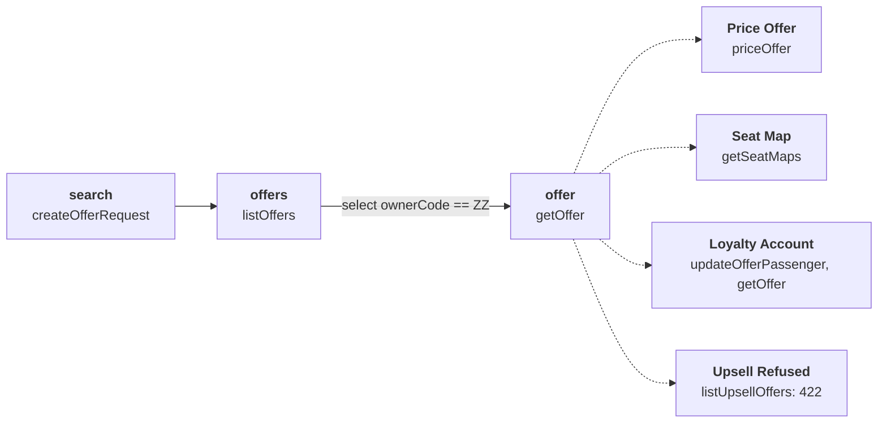
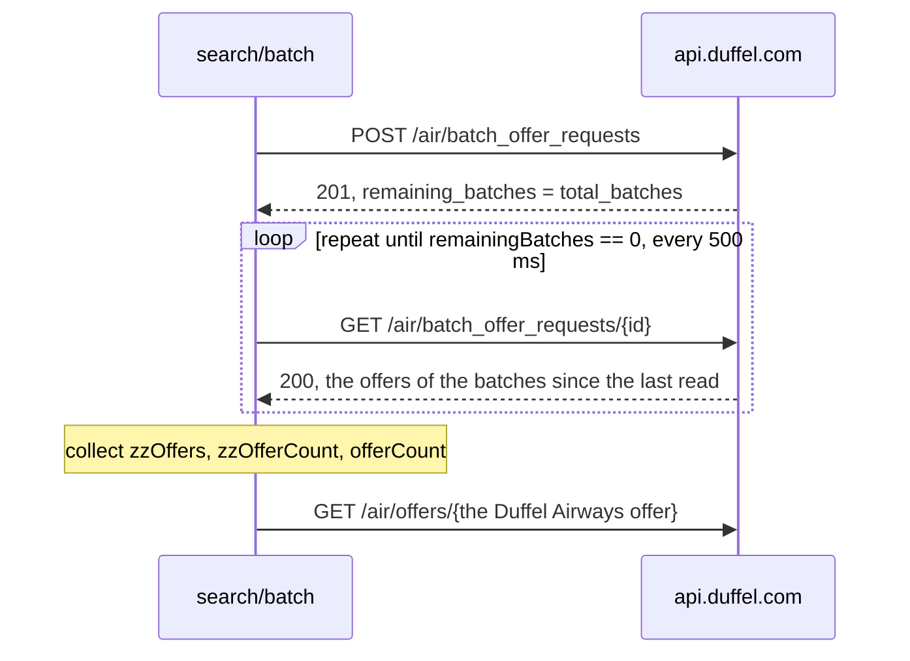
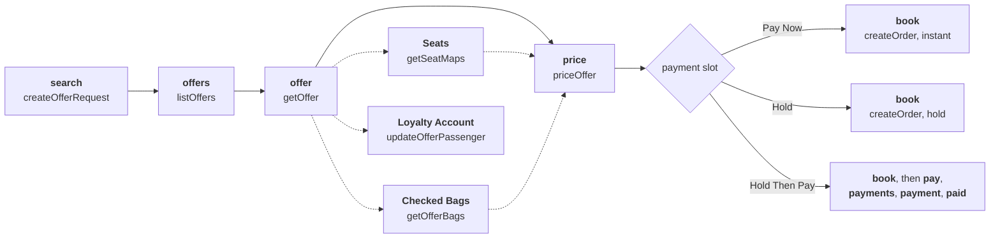

# aat-duffel

The [Duffel](https://duffel.com) flights API in test mode, as an [AAT](https://github.com/gburgyan/aat) project. A
graph describes each endpoint, workflows chain the endpoints, and plans prove what the API really does by running
against Duffel's live test API. What this README says about Duffel comes from those runs. It says so where a run showed
something that no plan asserts yet, and it names Duffel's docs where they're the source.

**Status:** places, reference data, search, offers, and booking are done: 32 endpoints, all run by 27 plans that pass
together in about 95 seconds. Changes, cancellations, and the account features come next
([what's not covered yet](#not-covered-yet)).

```text
$ aat run plan search/one-way
  [1/5] search               201  2.0s
        Offer request: orq_0000BAQwqqZycG9wjyQe8W
  [2/5] offers (listOffers)  200  344ms
        Cheapest: 216.71
  [3/5] offer (getOffer)     200  272ms
        Airline: ZZ
        Total: 221.78
  [4/5] inc0_priced          200  291ms
        Priced total: 221.78
  [5/5] inc1_seats           200  234ms
        Seats for sale: 76

PASSED (5/5 steps, 3.1s)
```

That run searched London to New York and listed the offers cheapest first. From the list it picked Duffel's own test
airline, priced that offer for a balance payment, and read its seat map. Every step checked what it read, as in "the
offer can be held, sells a checked bag, and states a penalty exactly when it allows a change". Then `aat web view
latest` shows the run:


## Getting started

### What you need

- **AAT built from `main`.** The package uses features that aren't in v0.1.0: lists in step values, extract
  `default:`, header extraction, `repeat`, visualizer `bodyPath`, nested blocks of the same key, `repeat.next` paging,
  and assertions that read an earlier step's output. The last two are open as gburgyan/aat#19 and #20 until they merge.
  Building from source needs Go 1.25.7 or later, and Node.js for the web UI:

  ```bash
  git clone https://github.com/gburgyan/aat.git
  cd aat && make build          # aat and aat-sandbox, with the web UI
  export PATH="$PWD:$PATH"
  ```

- **A Duffel test-mode access token**, from your Duffel dashboard. It starts with `duffel_test_`. The environments read
  it from `DUFFEL_ACCESS_TOKEN`, the variable Duffel's own client libraries use:

  ```bash
  export DUFFEL_ACCESS_TOKEN=duffel_test_...
  ```

Searches check that `live_mode` is false before anything is booked, so a live token stops a plan at its first search.
Every order a plan books carries `metadata.source: aat-duffel` and is cancelled in cleanup, and the last plan in a
batch checks that none is left.

### Run it

```bash
aat validate --strict            # check every file, template, workflow, and plan; no requests sent
aat run plan search/one-way      # the run above
aat run plan booking/instant-family-seats-bags   # book a family of four with seats and bags, then cancel it
aat run batch                    # all 27 plans, about 95 seconds; sequential, so the order guard runs last
aat run batch scenarios          # only Duffel's test routes
aat web view latest              # open the last run in the browser
```

A few ways to read a run without the browser:

```bash
aat run show latest                                   # every step: status, timing, assertions
aat run show latest --step offer --outputs            # what a step extracted
aat run show latest --step offer --response --path data.conditions
```

Long batches can use `--env test-ci`, which spaces requests 250 ms apart. Duffel allows 4000 requests a minute per
token, so this is courtesy toward the shared test airlines, not a limit.

## See it in the web UI

`aat web view latest` opens a run as a timeline of its steps. A step's page shows its request, response, extracted
outputs, assertions, and how each input was resolved. Three kinds of step also get a tab that draws their response,
from [`visualizers/`](visualizers/):

| Tab | Shown on | What it draws |
|---|---|---|
| **Offers** | `listOffers` | Every offer on the page, cheapest first: airline, journey, stops and duration, cabin and fare brand, whether it can be held, and the total. The airline chips show how many offers each airline sent, and Duffel Airways rows are highlighted. |
| **Seat map** | any response shaped like a seat map | Each segment's cabin, row by row: seats for sale, seats for sale with a disclosure such as "Passenger must be an adult", seats not for sale, exits, and facilities |
| **Offers in this batch** | a batch search's read | The offers that read brought, and how many batches are left |
| **Order** | any response with a booking reference | The order's state (paid, awaiting payment by its deadline, or cancelled) and totals, the itinerary with each flight's cabin and seats, passengers with their type and loyalty accounts, services, changes, the cancellation's refund, and the actions the order allows |

Run `aat run plan search/one-way` and open it. The `offers` step lists what the search found. With direct flights
only, this run found 73 offers from 7 airlines:


The `inc1_seats` step draws the Duffel Airways offer's cabin:


A batch search shows AAT's `repeat`. Run `aat run plan search/batch`: the `batches` step reads the search again until
no batches remain. Its tab draws the last read, and `aat run show latest --step batches` says how many reads it took
and why it stopped, as in `3 requests (stopped: until)`:


A booking step gets an Order tab. Run `aat run plan booking/instant-family-seats-bags` and pick the `book` step:


The visualizers are plain HTML files that receive the response body from the web UI. Matching is declared in
[`visualizers/visualizers.yaml`](visualizers/visualizers.yaml). Every Duffel response is wrapped in `{"data": …}`, so
the seat map matches on a nested path rather than a node name:

```yaml
- id: seat-map
  name: Seat map
  file: seat-map.html
  match:
    bodyPath: data.0.cabins
```

## How the plans fit together

Most plans that search reuse one workflow, [Find Offer](workflows/find-offer.yaml). It searches, lists the offers
cheapest first, and picks the Duffel Airways offer, never the first or the cheapest. Addons extend it:



A plan that reuses the workflow is a recipe. It picks addons and overrides values and assertions, and AAT composes
the full plan when it runs. Here is the whole of the connecting-flights scenario:

```yaml
kind: recipe
metadata:
  prompt: Search Duffel's multi-segment test route
  graphVersion: "1.0.0"
selection:
  workflow: Find Offer
  description: The Duffel Airways offer's first slice has two flights
overrides:
  values:
    search.origin: LHR
    search.destination: DXB
  assertions:
    offer:
      - type: predicate
        expr: firstSliceSegmentCount == 2
```

A batch search can't be a single read, since its offers arrive a supplier at a time. The [batch plan](plans/search/batch.yaml)
repeats the read until nothing remains, gathering outputs from every response:



```yaml
- id: batches
  node: getBatchOfferRequest
  values:
    batchOfferRequestId: {from: start.batchOfferRequestId}
  repeat:
    until: remainingBatches == 0
    collect: [zzOffers, zzOfferCount, offerCount]
    interval: 500ms
    max: 30
    timeout: 50s
  assertions:
    mechanical:
      - type: predicate
        expr: zzOfferCount >= 1 && offerCount > zzOfferCount
```

Booking plans reuse [Book Flight](workflows/book-flight.yaml). Its `payment` slot picks how the order is paid, addons
add seats, bags, a loyalty account, or a metadata update, and [party layers](layers/) set the passengers. The priced
services go into the order as they are, so an instant order pays exactly the priced total:



Here is the whole of the family booking:

```yaml
kind: recipe
selection:
  workflow: Book Flight
  choices:
    payment: Pay Now
  addons: [Seats, Checked Bags]
  layers: [party-family]
overrides:
  assertions:
    book:
      - type: predicate
        expr: >-
          passengerCount == 4 && adultCount == 2 && childCount == 1 && infantCount == 1 &&
          seatCount >= 3 && bagCount >= 3
```

Every order is cancelled when its plan ends. `createOrder`'s cleanup quotes a cancellation, and that quote's cleanup
confirms it:

```yaml
createOrder:
  cleanup:
    node: createOrderCancellation
    when: cancellable == true
createOrderCancellation:
  cleanup: confirmOrderCancellation
```

`aat run show <batch>` sums up what cleanup did. The last full batch cancelled 6 orders with 0 cleanup failures. Then
[`zz-no-live-orders`](plans/zz-no-live-orders.yaml), which sorts last, reads every page of the account's orders and
fails if one of the package's orders is still active:

```yaml
- id: orders
  node: listOrders
  values:
    limit: 200
  repeat:
    next: {after: nextCursor}
    collect: [orderCount, ourOrderCount, ourActiveOrderCount, ourActiveOrders, otherActiveOrderCount, liveModeOrderCount]
    max: 100
  assertions:
    mechanical:
      - type: predicate
        expr: orderCount > 0 && ourOrderCount > 0 && ourActiveOrderCount == 0 && liveModeOrderCount == 0
```

Orders from other sources on the same account are counted apart and never fail it.

## What's exercised

### Endpoints

Each endpoint is a node in [`graph.yaml`](graph.yaml), with a template in [`templates/`](templates/). Every node runs in
at least one plan, the cancellation nodes in cleanup.

| Endpoint | Node | Run by |
|---|---|---|
| `GET /places/suggestions` | `suggestPlaces` | [places](plans/reference/places.yaml), [airports-and-cities](plans/reference/airports-and-cities.yaml) |
| `GET /air/airports`, `GET /air/airports/{id}` | `listAirports`, `getAirport` | [airports-and-cities](plans/reference/airports-and-cities.yaml) |
| `GET /air/cities`, `GET /air/cities/{id}` | `listCities`, `getCity` | [airports-and-cities](plans/reference/airports-and-cities.yaml) |
| `GET /air/airlines`, `GET /air/airlines/{id}` | `listAirlines`, `getAirline` | [airlines-aircraft-loyalty](plans/reference/airlines-aircraft-loyalty.yaml) |
| `GET /air/aircraft`, `GET /air/aircraft/{id}` | `listAircraft`, `getAircraft` | [airlines-aircraft-loyalty](plans/reference/airlines-aircraft-loyalty.yaml) |
| `GET /air/loyalty_programmes`, `GET /air/loyalty_programmes/{id}` | `listLoyaltyProgrammes`, `getLoyaltyProgramme` | [airlines-aircraft-loyalty](plans/reference/airlines-aircraft-loyalty.yaml) |
| `POST /air/offer_requests` | `createOfferRequest` | Find Offer, [journey-shapes](plans/search/journey-shapes.yaml), [offer-requests](plans/search/offer-requests.yaml), three scenarios |
| `GET /air/offer_requests/{id}`, `GET /air/offer_requests` | `getOfferRequest`, `listOfferRequests` | [offer-requests](plans/search/offer-requests.yaml) |
| `GET /air/offers` | `listOffers` | Find Offer, [no-offers](plans/scenarios/no-offers.yaml), [offer-gone](plans/scenarios/offer-gone.yaml) |
| `GET /air/offers/{id}` | `getOffer` | Find Offer, [batch](plans/search/batch.yaml), [offer-gone](plans/scenarios/offer-gone.yaml) |
| `POST /air/offers/{id}/actions/price` | `priceOffer` | [one-way](plans/search/one-way.yaml), Book Flight |
| `GET /air/seat_maps` | `getSeatMaps` | [one-way](plans/search/one-way.yaml), [instant-family-seats-bags](plans/booking/instant-family-seats-bags.yaml), [hold-then-pay-trio-seats](plans/booking/hold-then-pay-trio-seats.yaml) |
| `GET /air/offers/{id}?return_available_services=true` | `getOfferBags` | [instant-family-seats-bags](plans/booking/instant-family-seats-bags.yaml) |
| `PATCH /air/offers/{offer_id}/passengers/{id}` | `updateOfferPassenger` | [loyalty](plans/search/loyalty.yaml) |
| `POST /air/offers/{id}/upsell_offers` | `listUpsellOffers` | [upsell](plans/search/upsell.yaml) |
| `POST /air/batch_offer_requests`, `GET /air/batch_offer_requests/{id}` | `createBatchOfferRequest`, `getBatchOfferRequest` | [batch](plans/search/batch.yaml) |
| `POST /air/orders` | `createOrder` | Book Flight: the [booking plans](plans/booking/) and the order-side scenarios |
| `GET /air/orders/{id}`, `PATCH /air/orders/{id}` | `getOrder`, `updateOrder` | Book Flight, [metadata](plans/booking/metadata.yaml) |
| `GET /air/orders` | `listOrders` | [zz-no-live-orders](plans/zz-no-live-orders.yaml), [metadata](plans/booking/metadata.yaml), the order-side scenarios |
| `POST /air/payments`, `GET /air/payments`, `GET /air/payments/{id}` | `createPayment`, `listPayments`, `getPayment` | [hold-then-pay-trio-seats](plans/booking/hold-then-pay-trio-seats.yaml) |
| `POST /air/order_cancellations`, `POST /air/order_cancellations/{id}/actions/confirm` | `createOrderCancellation`, `confirmOrderCancellation` | cleanup, after every booking |

### Plans

| Plan | What it proves |
|---|---|
| [reference/places](plans/reference/places.yaml) | Heathrow by name is airport LHR in city LON, and a search 20 km around its runways finds it. London is a city that lists its airports. A query that matches nothing is 200 with an empty list. |
| [reference/airports-and-cities](plans/reference/airports-and-cities.yaml) | Two pages of airports joined by their cursor, with the rate-limit headers read as numbers. A page of cities with their airports. Heathrow and London read by the IDs a place lookup returned. |
| [reference/airlines-aircraft-loyalty](plans/reference/airlines-aircraft-loyalty.yaml) | Each list's first entry read back by ID, and a loyalty programme's airline read by the owner ID it names |
| [search/one-way](plans/search/one-way.yaml) | Direct flights from LHR to JFK. The Duffel Airways offer can be held, sells a checked bag, and states change and refund penalties exactly when it allows them. It prices for a balance payment and has seats for sale. |
| [search/journey-shapes](plans/search/journey-shapes.yaml) | One-way, round trip, an open jaw on to LAX, and a family of four in premium economy, with each search's slices and passengers checked |
| [search/offer-requests](plans/search/offer-requests.yaml) | An offer request read back with its offers inlined, and the account's recent offer requests paged |
| [search/loyalty](plans/search/loyalty.yaml) | Duffel's test loyalty account attached to the offer's passenger, and still on the offer when it's read again |
| [search/upsell](plans/search/upsell.yaml) | Duffel Airways refuses upsell offers: 422 `unsupported_action`, an `airline_error` |
| [search/batch](plans/search/batch.yaml) | A batch search polled until no batches remain, with the Duffel Airways offers collected on the way |
| [booking/instant-solo](plans/booking/instant-solo.yaml) | One adult booked and paid at once, at exactly the priced total. The order carries the package's tag and allows cancel, change, and update. |
| [booking/instant-family-seats-bags](plans/booking/instant-family-seats-bags.yaml) | Two adults, a child, and an infant on a lap, with seats and extra bags. The order books exactly the services priced (in one run, 3 seats and 4 bags) and counts each passenger type. |
| [booking/hold-couple](plans/booking/hold-couple.yaml) | Two adults held unpaid at the priced total, with a payment deadline and a price guarantee |
| [booking/hold-then-pay-trio-seats](plans/booking/hold-then-pay-trio-seats.yaml) | An adult, a child, and an infant held with seats, then paid at the held total. The payment reads back, and the paid order's total is unchanged. |
| [booking/loyalty-member](plans/booking/loyalty-member.yaml) | The test loyalty account attached before booking: the order books below the offer's first price and keeps the account |
| [booking/metadata](plans/booking/metadata.yaml) | A reference stored at booking, replaced with PATCH, and the order found again by its booking reference |
| [zz-no-live-orders](plans/zz-no-live-orders.yaml) | Every page of the account's orders, read with `repeat.next`: none of the package's orders is still active |

### Duffel's test routes

Duffel's test mode simulates situations on fixed one-way routes. Each has a plan under
[`plans/scenarios/`](plans/scenarios/), and each plan asserts the outcome, including the error `code` when there is
one.

| Route | Duffel simulates | The plan asserts |
|---|---|---|
| PVD → RAI | no flights | [no-offers](plans/scenarios/no-offers.yaml): the search succeeds, and its offers page is empty |
| JFK → EWR | offers that can only be held | [holdable-offers](plans/scenarios/holdable-offers.yaml): no offer on the page needs instant payment |
| LHR → DXB | connecting flights | [connecting-flights](plans/scenarios/connecting-flights.yaml): the offer's first slice has two flights |
| DXB → AMS | a stop within a flight | [stop-within-segment](plans/scenarios/stop-within-segment.yaml): one flight, with one stop and its airport |
| BTS → MRU | no baggage | [no-baggage](plans/scenarios/no-baggage.yaml): the offer includes no bags |
| BTS → ABV | no extra services | [no-services](plans/scenarios/no-services.yaml): nothing for sale, though the fare still includes bags |
| STN → LHR | a search that times out | [search-timeout](plans/scenarios/search-timeout.yaml): 504 `gateway_timeout_error`, an `api_error` |
| LGW → LHR | an offer gone by the time it's read | [offer-gone](plans/scenarios/offer-gone.yaml): 422 `offer_no_longer_available` |
| LHR → LGW | an order the airline fails | [order-creation-error](plans/scenarios/order-creation-error.yaml): 502 `airline_unknown`, an `airline_error`, and no order |
| LGW → STN | a balance too low to pay | [insufficient-balance](plans/scenarios/insufficient-balance.yaml): 422 `insufficient_balance`, an `invalid_state_error`, and no order |
| LHR → STN | a price that rises with every read | [price-changed-at-booking](plans/scenarios/price-changed-at-booking.yaml): the second read costs more, and paying the first read's total is 422 `payment_amount_does_not_match_order_amount`, with no order |

## What Duffel does in test mode

These notes come from the runs. They're also in [`domain.yaml`](domain.yaml), where AI tools that read the project
find them.

- **Searches are big.** One adult from LHR to JFK brought 229 offers from many airlines, which would be 1.5 MB inlined
  in the search response. The plans search with `return_offers=false` and page the offers cheapest first.
- **Duffel Airways (ZZ) is the airline to pick.** The other airlines in test mode are sandboxes that don't book
  reliably, so every plan selects the offer whose owner is ZZ.
- **A Duffel Airways offer can always be held**, with payment due a few days later.
- **Change and refund conditions vary between searches.** Twelve fares from LHR to JFK showed all four combinations.
  An allowed change or refund states a 40.00 penalty, and a refused one states none, so the plans check that pairing
  rather than a fixed answer.
- **Extras are sold per passenger.** The offer includes a checked and a carry-on bag, and sells one extra 23 kg bag at
  20.00. Its economy cabin has 192 seats, 76 of them for sale at 20.00.
- **No upsells.** Duffel Airways answers the upsell action with 422 `unsupported_action`.
- **The test loyalty account takes 10% off.** With Amelia Earhart's Duffel Airways account (1234567890) on the
  passenger, 227.33 became 204.60: the two totals in the loyalty plan's output. An order booked afterwards pays the
  member price and keeps the account.
- **Batch searches arrive a supplier at a time.** `remaining_batches` falls unevenly (6, 2, 1, 0 in one run), each
  read returns only the new offers, and Duffel Airways came in the first batch. A batch search expires a minute
  after it starts.
- **Offers expire** about 30 minutes after the search. Every run searches again, so plans never read stale offers
  except on purpose.
- **Lists page with cursors.** `meta.after` is `null` on the last page. Every response carries lowercase
  `ratelimit-*` headers (4000 requests a minute) and an `x-request-id`.
- **Booking takes the priced total exactly.** An instant order pays from the balance at the price action's total,
  services included, and books exactly the services priced: 20.00 for each Duffel Airways seat and each extra 23 kg
  bag.
- **Birth dates must fit the ages searched.** Duffel checks each one as of the last flight's departure. An infant is
  booked by naming it on an adult as `infant_passenger_id`, and takes no seat. The order's passengers echo neither
  that link nor a passenger type.
- **Holds are due in 72 hours.** A held order's payment deadline is the search's creation time plus 72 hours, and its
  price is guaranteed for 48. Seats and bags can be held too, and paying at the held total leaves the total
  unchanged.
- **Metadata is the only thing an order update changes.** PATCH replaces it, and the `booking_reference` and
  `offer_id` list filters find the order again.
- **Refused orders leave nothing behind.** On each order-side test route, listing orders by the offer finds none.

## AAT features on display

| Feature | In this package |
|---|---|
| Workflows, addons, and recipes | [Find Offer](workflows/find-offer.yaml), [Book Flight](workflows/book-flight.yaml), and their [addons](workflows/addons/). Most plans are short recipes that reuse them. |
| Slots and layers | Book Flight's `payment` slot picks Pay Now, Hold, or Hold Then Pay, and [party layers](layers/) set one to four passengers |
| Cleanup chains | `createOrder` → `createOrderCancellation` → `confirmOrderCancellation`, with `when: cancellable == true`, and `aat run show <batch>` sums up every cleanup |
| Paging with `repeat.next` | [`zz-no-live-orders`](plans/zz-no-live-orders.yaml) reads every page of the account's orders, and fails if a listing is cut off |
| Assertions across steps | `serviceCount == "{{price.intendedServiceCount}}"` in the Pay Now slot, and `totalAmount > "{{offer.totalAmount}}"` on the price change route |
| Selection by filter | `select: {strategy: match, field: id, filter: ownerCode == "ZZ"}` picks the offer in Find Offer |
| Repeating a read until a condition holds | [`search/batch`](plans/search/batch.yaml): `repeat` with `until`, `collect`, `interval`, `max`, and `timeout` |
| Expected failures, checked by error code | [`search-timeout`](plans/scenarios/search-timeout.yaml), [`offer-gone`](plans/scenarios/offer-gone.yaml), the three order-side routes, and [Upsell Refused](workflows/addons/upsell-refused.yaml) |
| Response headers as typed outputs | [`listAirports`](templates/listAirports.yaml) reads `ratelimit-limit` and `ratelimit-remaining`, and a plan compares them |
| gjson in extract rules | Counts (`data.slices.#`), queries (`data.offers.#(owner.iata_code=="ZZ")#`), and defaults (`nextCursor: {path: meta.after, default: ""}`) |
| Conditional and iteration blocks | [`createOfferRequest`](templates/createOfferRequest.yaml) adds a return or onward slice only when asked, and writes one passenger per age |
| Lists and date expressions in step values | `passengerAges: [40, 38, 8, 1]` and `departureDate: "{{today + 30 days}}"` in [`journey-shapes`](plans/search/journey-shapes.yaml) |
| Lua, where a transform earns its place | [`getSeatMaps`](templates/getSeatMaps.yaml) flattens each seat map's cabins, rows, and sections into one entry per seat per passenger |
| `display:` outputs | The offer request, cheapest total, airline, priced total, and seats for sale print under each step |
| Visualizers | [`visualizers/`](visualizers/): the offers table and the seat map, matched by node and by `bodyPath` |
| Environments | [`env.yaml`](env.yaml): `test`, and `test-ci`, which extends it and paces requests |
| Domain knowledge | [`domain.yaml`](domain.yaml): what the plans proved, as concepts for AI tools |
| Strict validation | `aat validate --strict` checks every file, template input, workflow, and plan without calling Duffel |

## Not covered yet

- **Next:**
  - **After booking:** changes, cancellations, services added to an order, payments, airline-initiated changes, and
    airline credits
  - **The account:** customer users and groups, component client keys, Links sessions, and webhooks
- **Needs Duffel to enable it:** on the account this package was built against, Stays and Cars answer 403, and cards
  and 3-D Secure answer 403 `unavailable_feature`, so the order-side test routes that pay by card (LTN → STN,
  SEN → STN, and LCY → STN) aren't covered
- **Left out, per Duffel's docs:** partial offer requests (deprecated), Payment Intents and Refunds (closed to new
  customers), ARC/BSP cash payments, and private fares (no test codes)

## Repository layout

```text
aat-project.yaml    the manifest: where everything is, and the default environment
env.yaml            test and test-ci: api.duffel.com, Duffel-Version v2, the token from DUFFEL_ACCESS_TOKEN
graph.yaml          22 nodes: each endpoint's inputs and outputs, and what Duffel does
templates/          one request and response template per node
domain.yaml         what the plans proved about Duffel, as concepts
workflows/          Find Offer, Book Flight with its payment slots, and their addons
layers/             parties of one to four passengers
plans/reference/    places, airports, cities, airlines, aircraft, and loyalty programmes
plans/search/       searches, offers, pricing, seat maps, loyalty, upsells, and batch search
plans/booking/      orders paid at once or held, with seats, bags, loyalty, and metadata
plans/scenarios/    Duffel's test routes, search and order side
plans/zz-no-live-orders.yaml   the guard that no order the package booked is left active
visualizers/        the Offers, Seat map, and Order tabs for the web UI
docs/images/        the screenshots in this README
```

Run output goes to `_output/`, which git ignores, along with one-off `probes/`, `setup-*.sh`, `env.secrets*.yaml`, and
`.env`, so a token kept in one of those never reaches the repository.
