# Duffel Flights API (test mode)

66 nodes | Version 1.0.0

Duffel's flights API as it behaves in test mode, verified by running every plan in this project against api.duffel.com. Every request carries a bearer token and Duffel-Version: v2; request and success bodies are wrapped in {"data": ...}, and errors come back as {"errors": [{type, title, message, code}], "meta": {request_id, status}}.

## Workflow Diagram

```mermaid
graph TD
    acceptAirlineInitiatedChange["acceptAirlineInitiatedChange<br/>Accept an airline-initiated change (POST /air/a..."]
    addOrderServices["addOrderServices<br/>Add a service to a booked order (POST /air/orde..."]
    confirmOrderCancellation["confirmOrderCancellation<br/>Confirm a cancellation quote (POST /air/order_c..."]:::cleanup
    confirmOrderChange["confirmOrderChange<br/>Confirm a pending change (POST /air/order_chang..."]
    createAirlineCredit["createAirlineCredit<br/>Record an airline credit the account holds (POS..."]
    createBatchOfferRequest["createBatchOfferRequest<br/>Start a search whose offers arrive in batches (..."]
    createComponentClientKey["createComponentClientKey<br/>Issue a component client key for Duffel's UI co..."]
    createCustomerUser["createCustomerUser<br/>Create a customer user (POST /identity/customer..."]
    createCustomerUserGroup["createCustomerUserGroup<br/>Create a customer user group (POST /identity/cu..."]
    createLinksSession["createLinksSession<br/>Start a Duffel Links checkout session (POST /li..."]
    createOfferRequest["createOfferRequest<br/>Search for flights (POST /air/offer_requests?re..."]
    createOrder["createOrder<br/>Book an offer (POST /air/orders, 201). An insta..."]
    createOrderCancellation["createOrderCancellation<br/>Quote an order's cancellation (POST /air/order_..."]:::cleanup
    createOrderChange["createOrderChange<br/>Choose a change offer (POST /air/order_changes,..."]
    createOrderChangeRequest["createOrderChangeRequest<br/>Ask what it costs to replace an order's slice w..."]
    createPayment["createPayment<br/>Pay a held order (POST /air/payments, 201), fro..."]
    createWebhook["createWebhook<br/>Register a webhook (POST /air/webhooks, 201). D..."]
    deleteCustomerUserGroup["deleteCustomerUserGroup<br/>Delete a customer user group (DELETE /identity/..."]:::cleanup
    deleteWebhook["deleteWebhook<br/>Delete a webhook (DELETE /air/webhooks/{id})."]:::cleanup
    getAircraft["getAircraft<br/>Read one aircraft type by its arc_ ID (GET /air..."]
    getAirline["getAirline<br/>Read one airline by its arl_ ID (GET /air/airli..."]
    getAirlineCredit["getAirlineCredit<br/>Read an airline credit (GET /air/airline_credit..."]
    getAirport["getAirport<br/>Read one airport by its arp_ ID (GET /air/airpo..."]
    getBatchOfferRequest["getBatchOfferRequest<br/>Read the batches of a batch search that have ar..."]
    getCity["getCity<br/>Read one city by its cit_ ID (GET /air/cities/{..."]
    getCustomerUser["getCustomerUser<br/>Read a customer user (GET /identity/customer/us..."]
    getCustomerUserGroup["getCustomerUserGroup<br/>Read a customer user group (GET /identity/custo..."]
    getLoyaltyProgramme["getLoyaltyProgramme<br/>Read one loyalty programme by its loy_ ID (GET ..."]
    getOffer["getOffer<br/>Read one offer at its latest price, with the ex..."]
    getOfferBags["getOfferBags<br/>Read an offer's extra checked bags (GET /air/of..."]
    getOfferRequest["getOfferRequest<br/>Read an offer request (GET /air/offer_requests/..."]
    getOrder["getOrder<br/>Read an order (GET /air/orders/{id}, 200): its ..."]
    getOrderCancellation["getOrderCancellation<br/>Read a cancellation, quoted or confirmed (GET /..."]
    getOrderChange["getOrderChange<br/>Read an order change (GET /air/order_changes/{i..."]
    getOrderChangeOffer["getOrderChangeOffer<br/>Read one change offer (GET /air/order_change_of..."]
    getOrderChangeRequest["getOrderChangeRequest<br/>Read an order change request with its change of..."]
    getPayment["getPayment<br/>Read one payment by its ID (GET /air/payments/{..."]
    getSeatMaps["getSeatMaps<br/>Read an offer's seat maps (GET /air/seat_maps?o..."]
    getWebhookEvent["getWebhookEvent<br/>Read a webhook event (GET /air/webhooks/events/..."]
    listAircraft["listAircraft<br/>Page through the aircraft types segments are fl..."]
    listAirlineCredits["listAirlineCredits<br/>List the account's airline credits (GET /air/ai..."]
    listAirlineInitiatedChanges["listAirlineInitiatedChanges<br/>List an order's airline-initiated changes (GET ..."]
    listAirlines["listAirlines<br/>Page through the airlines Duffel sells (GET /ai..."]
    listAirports["listAirports<br/>Page through every airport Duffel knows, in nam..."]
    listCities["listCities<br/>Page through the cities Duffel groups airports ..."]
    listCustomerUserGroups["listCustomerUserGroups<br/>List customer user groups (GET /identity/custom..."]
    listCustomerUsers["listCustomerUsers<br/>List customer users, optionally by email (GET /..."]
    listLoyaltyProgrammes["listLoyaltyProgrammes<br/>Page through the airline loyalty programmes a p..."]
    listOfferRequests["listOfferRequests<br/>Page through the account's offer requests (GET ..."]
    listOffers["listOffers<br/>Page through an offer request's offers (GET /ai..."]
    listOrderAvailableServices["listOrderAvailableServices<br/>List the services a booked order can still add ..."]
    listOrderCancellations["listOrderCancellations<br/>List an order's cancellations (GET /air/order_c..."]
    listOrderChangeOffers["listOrderChangeOffers<br/>Page through a change request's offers, cheapes..."]
    listOrders["listOrders<br/>Page through the account's orders (GET /air/ord..."]
    listPayments["listPayments<br/>List an order's payments (GET /air/payments?ord..."]
    listUpsellOffers["listUpsellOffers<br/>Ask for the same journey in higher fare brands ..."]
    listWebhookDeliveries["listWebhookDeliveries<br/>List the attempts Duffel made to deliver webhoo..."]
    listWebhooks["listWebhooks<br/>List the account's webhooks (GET /air/webhooks,..."]
    pingWebhook["pingWebhook<br/>Send a webhook a test event (POST /air/webhooks..."]
    priceOffer["priceOffer<br/>Price an offer with the services and payment me..."]
    suggestPlaces["suggestPlaces<br/>Look up airports and cities by name or near a p..."]
    updateCustomerUser["updateCustomerUser<br/>Replace a customer user's details (PUT /identit..."]
    updateCustomerUserGroup["updateCustomerUserGroup<br/>Rename a customer user group or set its member ..."]
    updateOfferPassenger["updateOfferPassenger<br/>Name an offer's passenger and attach loyalty pr..."]
    updateOrder["updateOrder<br/>Replace an order's metadata (PATCH /air/orders/..."]
    updateWebhook["updateWebhook<br/>Activate or deactivate a webhook, or change its..."]

    createCustomerUserGroup -.-> deleteCustomerUserGroup
    createOrder -.-> createOrderCancellation
    createOrderCancellation -.-> confirmOrderCancellation
    createWebhook -.-> deleteWebhook
    listAirlineInitiatedChanges --> acceptAirlineInitiatedChange
    createOrder --> addOrderServices
    createOrderChange --> confirmOrderChange
    getOffer --> createOrder
    getOrderChangeOffer --> createOrderChange
    createOrder --> createOrderChangeRequest
    createOrder --> createPayment
    listAircraft --> getAircraft
    listAirlines --> getAirline
    listAirports --> getAirport
    createBatchOfferRequest --> getBatchOfferRequest
    listCities --> getCity
    createCustomerUser --> getCustomerUser
    createCustomerUserGroup --> getCustomerUserGroup
    listLoyaltyProgrammes --> getLoyaltyProgramme
    listOffers --> getOffer
    getOffer --> getOfferBags
    createOfferRequest --> getOfferRequest
    createOrder --> getOrder
    createOrderCancellation --> getOrderCancellation
    createOrderChange --> getOrderChange
    createOrderChangeRequest --> getOrderChangeRequest
    createPayment --> getPayment
    getOffer --> getSeatMaps
    listWebhookDeliveries --> getWebhookEvent
    createOrder --> listAirlineInitiatedChanges
    createOfferRequest --> listOffers
    createOrder --> listOrderAvailableServices
    createOrder --> listOrderCancellations
    createOrderChangeRequest --> listOrderChangeOffers
    createOrder --> listPayments
    getOffer --> listUpsellOffers
    createWebhook --> pingWebhook
    getOffer --> priceOffer
    createCustomerUser --> updateCustomerUser
    createCustomerUserGroup --> updateCustomerUserGroup
    getOffer --> updateOfferPassenger
    createOrder --> updateOrder
    createWebhook --> updateWebhook

    classDef cleanup fill:#fee,stroke:#c33,stroke-dasharray:5 5
```

## Workflows

### Find Offer

Search, list the offers cheapest first, and read the Duffel Airways offer at its latest price

### Price Offer

Price the offer for a balance payment

**Addon:** splices after `getOffer`

### Seat Map

Read the offer's seat maps and the seats for sale

**Addon:** splices after `getOffer`

### Loyalty Account

Attach Duffel's test loyalty account to the passenger and read the offer at its member price

**Addon:** splices after `getOffer`

### Upsell Refused

Ask for upsell offers, which Duffel Airways refuses with 422 unsupported_action

**Addon:** splices after `getOffer`

### Book Flight

Search, pick the Duffel Airways offer, price what the order buys, and book it, paid at once or held

### Pay Now

Book the offer and pay the priced total from the balance

### Hold

Hold the offer unpaid, to be paid by its deadline

### Hold Then Pay

Hold the offer, then pay it at the total it was held for

### Seats

Pick a seat for each passenger on each flight, bought with the order

**Addon:** splices after `getOffer`

### Checked Bags

Buy an extra checked bag for each passenger on each flight, with the order

**Addon:** splices after `getOffer`

### Update Metadata

Replace the order's metadata, then find the order by its booking reference

**Addon:** splices after `createPayment, createOrder`

### Change Flight

Move the first flight a week later in premium economy at 18:00, confirm it, and check the order's cabin, time, and total; a second change is refused

**Addon:** splices after `createPayment, createOrder`

### Airline-Initiated Change

Read the change Duffel Airways makes on the LHR to LTN test route, accept it, and check the flight's new time

**Addon:** splices after `createPayment, createOrder`

### Cancel Order

Quote the cancellation, confirm it, and check the refund on the cancelled order; a second quote and a second confirmation are refused

**Addon:** splices after `createPayment, createOrder`

## Entry Points

- [**acceptAirlineInitiatedChange**](nodes/acceptAirlineInitiatedChange.md) — Accept an airline-initiated change (POST /air/airline_initiated_changes/{id}/actions/accept). Only the order's latest change can be accepted; an older one gets 422 stale_airline_initiated_change_accept.
- [**addOrderServices**](nodes/addOrderServices.md) — Add a service to a booked order (POST /air/orders/{id}/services), paying for it from the balance when an amount is given; a held order takes no payment.
- [**confirmOrderCancellation**](nodes/confirmOrderCancellation.md) — Confirm a cancellation quote (POST /air/order_cancellations/{id}/actions/confirm, 200), which cancels the order and refunds it.
- [**confirmOrderChange**](nodes/confirmOrderChange.md) — Confirm a pending change (POST /air/order_changes/{id}/actions/confirm, 200), paying its cost from the balance when it has one.
- [**createAirlineCredit**](nodes/createAirlineCredit.md) — Record an airline credit the account holds (POST /air/airline_credits).
- [**createBatchOfferRequest**](nodes/createBatchOfferRequest.md) — Start a search whose offers arrive in batches (POST /air/batch_offer_requests, 201), to show results as each supplier answers. The response has the ID, total_batches, and remaining_batches, and no offers. Read the batches with getBatchOfferRequest within a minute, after which the search expires.
- [**createComponentClientKey**](nodes/createComponentClientKey.md) — Issue a component client key for Duffel's UI components (POST /identity/component_client_keys), with no claims, a user, or a user and an order. The key is a credential, so no output holds it.
- [**createCustomerUser**](nodes/createCustomerUser.md) — Create a customer user (POST /identity/customer/users, 201). Duffel's API reference lists no way to delete one, so each run's user stays on the account, with an email unique to the run.
- [**createCustomerUserGroup**](nodes/createCustomerUserGroup.md) — Create a customer user group (POST /identity/customer/user_groups, 201), optionally with a member. Cleanup deletes it.
- [**createLinksSession**](nodes/createLinksSession.md) — Start a Duffel Links checkout session (POST /links/sessions). The session URL books on the account, so no output holds it: only whether one came back and its host.
- [**createOfferRequest**](nodes/createOfferRequest.md) — Search for flights (POST /air/offer_requests?return_offers=false, 201). The response has the offer request's orq_ ID, its passengers with their pas_ IDs, and the slices searched, but no offers: listOffers pages them, where return_offers=true would put every offer in this response (1.5 MB for 229 offers from LHR to JFK). One slice is a one-way search; returnDate adds the way back, and stopover with onwardDate adds an open-jaw leg from destination to stopover instead. Passengers are given by age. live_mode is false for a test token. A supplier slower than supplierTimeout milliseconds is left out; Duffel's STN to LHR test route answers 504 gateway_timeout_error.
- [**createOrder**](nodes/createOrder.md) — Book an offer (POST /air/orders, 201). An instant order pays from the balance, with amount and currency exactly the priced total, services included; a hold order sends no payment and is paid later with createPayment. Each passenger is named with the offer's pas_ ID, a title, gender, names, and a birth date that fits the age searched, and an adult who carries an infant names that infant. Every order carries metadata.source "aat-duffel". Its cleanup cancels the order.
- [**createOrderCancellation**](nodes/createOrderCancellation.md) — Quote an order's cancellation (POST /air/order_cancellations, 201): the refund, where it goes, and when the quote expires. Nothing is cancelled until confirmOrderCancellation, which cleanup runs next.
- [**createOrderChange**](nodes/createOrderChange.md) — Choose a change offer (POST /air/order_changes, 201), which makes a pending change with its cost. Nothing changes on the order until confirmOrderChange.
- [**createOrderChangeRequest**](nodes/createOrderChangeRequest.md) — Ask what it costs to replace an order's slice with another (POST /air/order_change_requests, 201). The request removes one slice and adds a journey on a new date in a requested cabin, and answers with change offers, each with its added flight, what it costs, and the order's new total.
- [**createPayment**](nodes/createPayment.md) — Pay a held order (POST /air/payments, 201), from the balance or with an airline credit, with amount and currency exactly the order's total.
- [**createWebhook**](nodes/createWebhook.md) — Register a webhook (POST /air/webhooks, 201). Duffel allows one per live mode, and the signing secret comes back only here; no output holds it. Cleanup deletes the webhook.
- [**deleteCustomerUserGroup**](nodes/deleteCustomerUserGroup.md) — Delete a customer user group (DELETE /identity/customer/user_groups/{id}).
- [**deleteWebhook**](nodes/deleteWebhook.md) — Delete a webhook (DELETE /air/webhooks/{id}).
- [**getAircraft**](nodes/getAircraft.md) — Read one aircraft type by its arc_ ID (GET /air/aircraft/{id}, 200).
- [**getAirline**](nodes/getAirline.md) — Read one airline by its arl_ ID (GET /air/airlines/{id}, 200), with its logos and its conditions of carriage when Duffel has them.
- [**getAirlineCredit**](nodes/getAirlineCredit.md) — Read an airline credit (GET /air/airline_credits/{id}, 200).
- [**getAirport**](nodes/getAirport.md) — Read one airport by its arp_ ID (GET /air/airports/{id}, 200; an unknown ID is 404). Carries IATA and ICAO codes, the IATA code of its city, the country, coordinates, and the IANA time zone that departure and arrival times are local to.
- [**getBatchOfferRequest**](nodes/getBatchOfferRequest.md) — Read the batches of a batch search that have arrived since the last read (GET /air/batch_offer_requests/{id}, 200). Each read returns only the new batches' offers, and remaining_batches counts what is still to come, so repeat it until remaining_batches is 0, collecting the offers. Batches come per supplier, so the count falls unevenly (6, 2, 1, 0 in one run), and Duffel Airways arrives in the first.
- [**getCity**](nodes/getCity.md) — Read one city by its cit_ ID (GET /air/cities/{id}, 200), with the airports that serve it.
- [**getCustomerUser**](nodes/getCustomerUser.md) — Read a customer user (GET /identity/customer/users/{id}, 200).
- [**getCustomerUserGroup**](nodes/getCustomerUserGroup.md) — Read a customer user group (GET /identity/customer/user_groups/{id}, 200).
- [**getLoyaltyProgramme**](nodes/getLoyaltyProgramme.md) — Read one loyalty programme by its loy_ ID (GET /air/loyalty_programmes/{id}, 200), with the arl_ ID of the airline that runs it and its alliance, if any.
- [**getOffer**](nodes/getOffer.md) — Read one offer at its latest price, with the extra services it sells (GET /air/offers/{id}?return_available_services=true, 200). An offer expires about 30 minutes after the search; a stale one, as on the LGW to LHR test route, is 422 offer_no_longer_available. The price can move after the search: on the LHR to STN test route every read costs 10.00 more. A Duffel Airways offer can always be held, with payment due about three days later, and sells one extra 23 kg checked bag per passenger and segment. Whether it allows a change or a refund varies from search to search; an allowed one states its penalty.
- [**getOfferBags**](nodes/getOfferBags.md) — Read an offer's extra checked bags (GET /air/offers/{id}?return_available_services=true, 200), one service per passenger and segment. A step of its own names the bags an order buys, so getOffer's outputs don't wire bags into every order.
- [**getOfferRequest**](nodes/getOfferRequest.md) — Read an offer request (GET /air/offer_requests/{id}, 200). It inlines every offer the search produced, so the response is as large as return_offers=true would have made the search's; listOffers pages them instead.
- [**getOrder**](nodes/getOrder.md) — Read an order (GET /air/orders/{id}, 200): its payment state, the actions it allows, its passengers by type, slices with their cabin, services, and metadata.
- [**getOrderCancellation**](nodes/getOrderCancellation.md) — Read a cancellation, quoted or confirmed (GET /air/order_cancellations/{id}, 200).
- [**getOrderChange**](nodes/getOrderChange.md) — Read an order change (GET /air/order_changes/{id}, 200), pending or confirmed.
- [**getOrderChangeOffer**](nodes/getOrderChangeOffer.md) — Read one change offer (GET /air/order_change_offers/{id}, 200) with the flight it adds and its cost.
- [**getOrderChangeRequest**](nodes/getOrderChangeRequest.md) — Read an order change request with its change offers (GET /air/order_change_requests/{id}, 200).
- [**getPayment**](nodes/getPayment.md) — Read one payment by its ID (GET /air/payments/{id}, 200).
- [**getSeatMaps**](nodes/getSeatMaps.md) — Read an offer's seat maps (GET /air/seat_maps?offer_id=, 200): one map per segment, each with cabins of rows, sections, and elements. A seat is for sale when its available_services price it for a passenger, and some seats carry disclosures, such as "Passenger must be an adult". The Duffel Airways economy cabin has 192 seats, 76 of them for sale at 20.00. Seats are bought only with the order.
- [**getWebhookEvent**](nodes/getWebhookEvent.md) — Read a webhook event (GET /air/webhooks/events/{id}, 200).
- [**listAircraft**](nodes/listAircraft.md) — Page through the aircraft types segments are flown on (GET /air/aircraft, 200), with cursor pagination.
- [**listAirlineCredits**](nodes/listAirlineCredits.md) — List the account's airline credits (GET /air/airline_credits, 200), optionally a customer user's.
- [**listAirlineInitiatedChanges**](nodes/listAirlineInitiatedChanges.md) — List an order's airline-initiated changes (GET /air/airline_initiated_changes?order_id=, 200).
- [**listAirlines**](nodes/listAirlines.md) — Page through the airlines Duffel sells (GET /air/airlines, 200), with cursor pagination. Test mode's own airline, Duffel Airways, has IATA code ZZ.
- [**listAirports**](nodes/listAirports.md) — Page through every airport Duffel knows, in name order (GET /air/airports, 200). Pages use cursors: limit is 1 to 200, and after takes the previous page's meta.after, which is null on the last page. Every response reports the token's rate limit in ratelimit-* headers.
- [**listCities**](nodes/listCities.md) — Page through the cities Duffel groups airports under (GET /air/cities, 200), with the same cursor pagination as listAirports. Each city lists its airports.
- [**listCustomerUserGroups**](nodes/listCustomerUserGroups.md) — List customer user groups (GET /identity/customer/user_groups, 200).
- [**listCustomerUsers**](nodes/listCustomerUsers.md) — List customer users, optionally by email (GET /identity/customer/users, 200).
- [**listLoyaltyProgrammes**](nodes/listLoyaltyProgrammes.md) — Page through the airline loyalty programmes a passenger can book with (GET /air/loyalty_programmes, 200), with cursor pagination. Each names the airline that runs it.
- [**listOfferRequests**](nodes/listOfferRequests.md) — Page through the account's offer requests (GET /air/offer_requests, 200), with cursor pagination. Entries carry no offers.
- [**listOffers**](nodes/listOffers.md) — Page through an offer request's offers (GET /air/offers, 200), cheapest first with sort=total_amount; maxConnections 0 keeps direct flights only. Every offer prices all the passengers searched for and is owned by the airline that sells it. In test mode only Duffel Airways, owner ZZ, books reliably, so plans take the offer whose ownerCode is ZZ. A route with no flights, such as the PVD to RAI test route, gives an empty page.
- [**listOrderAvailableServices**](nodes/listOrderAvailableServices.md) — List the services a booked order can still add (GET /air/orders/{id}/available_services, 200).
- [**listOrderCancellations**](nodes/listOrderCancellations.md) — List an order's cancellations (GET /air/order_cancellations?order_id=, 200).
- [**listOrderChangeOffers**](nodes/listOrderChangeOffers.md) — Page through a change request's offers, cheapest change first (GET /air/order_change_offers?order_change_request_id=, 200), with cursor pagination.
- [**listOrders**](nodes/listOrders.md) — Page through the account's orders (GET /air/orders, 200) with cursor pagination: limit is 1 to 200, and after takes the previous page's meta.after. Filters narrow the list to the orders booked from an offer, a booking reference, a customer user's orders, or orders by payment state. Orders this package books carry metadata.source "aat-duffel", and each page counts those, the ones of them still active (not cancelled), and active orders from anywhere else, apart.
- [**listPayments**](nodes/listPayments.md) — List an order's payments (GET /air/payments?order_id=, 200).
- [**listUpsellOffers**](nodes/listUpsellOffers.md) — Ask for the same journey in higher fare brands (POST /air/offers/{id}/upsell_offers). Duffel Airways sells no upsells: the answer is 422 unsupported_action, an airline_error, and the JS client's /upsell path answers the same.
- [**listWebhookDeliveries**](nodes/listWebhookDeliveries.md) — List the attempts Duffel made to deliver webhook events (GET /air/webhooks/deliveries, 200), for one webhook or event type.
- [**listWebhooks**](nodes/listWebhooks.md) — List the account's webhooks (GET /air/webhooks, 200).
- [**pingWebhook**](nodes/pingWebhook.md) — Send a webhook a test event (POST /air/webhooks/{id}/actions/ping).
- [**priceOffer**](nodes/priceOffer.md) — Price an offer with the services and payment method an order will use (POST /air/offers/{id}/actions/price, 200). The response is the offer at that price; an instant order pays exactly its total_amount. A balance payment adds no surcharge. On the LHR to STN test route each call raises the price again.
- [**suggestPlaces**](nodes/suggestPlaces.md) — Look up airports and cities by name or near a point (GET /places/suggestions), answering 200 with a list, empty when nothing matches. Send query for a name or code, or lat, lng, and rad (metres) for a point. An airport (arp_, type airport) carries its city under city; a city (cit_, type city) lists its airports.
- [**updateCustomerUser**](nodes/updateCustomerUser.md) — Replace a customer user's details (PUT /identity/customer/users/{id}, 200); email and both names are required.
- [**updateCustomerUserGroup**](nodes/updateCustomerUserGroup.md) — Rename a customer user group or set its member (PATCH /identity/customer/user_groups/{id}, 200).
- [**updateOfferPassenger**](nodes/updateOfferPassenger.md) — Name an offer's passenger and attach loyalty programme accounts before booking (PATCH /air/offers/{offer_id}/passengers/{id}, 200). Read the offer again for its new price: Duffel's test loyalty account (Amelia Earhart, ZZ, 1234567890) takes 10% off a Duffel Airways offer.
- [**updateOrder**](nodes/updateOrder.md) — Replace an order's metadata (PATCH /air/orders/{id}, 200), the only thing it updates. The request sends the source tag again with the new reference.
- [**updateWebhook**](nodes/updateWebhook.md) — Activate or deactivate a webhook, or change its events (PATCH /air/webhooks/{id}, 200).

## Nodes

| Node | Description | Inputs | Outputs |
|------|-------------|--------|---------|
| [acceptAirlineInitiatedChange](nodes/acceptAirlineInitiatedChange.md) | Accept an airline-initiated change (POST /air/airline_initiated_changes/{id}/actions/accept). Only the order's latest change can be accepted; an older one gets 422 stale_airline_initiated_change_accept. | 1 | 2 |
| [addOrderServices](nodes/addOrderServices.md) | Add a service to a booked order (POST /air/orders/{id}/services), paying for it from the balance when an amount is given; a held order takes no payment. | 4 | 1 |
| [confirmOrderCancellation](nodes/confirmOrderCancellation.md) | Confirm a cancellation quote (POST /air/order_cancellations/{id}/actions/confirm, 200), which cancels the order and refunds it. | 1 | 4 |
| [confirmOrderChange](nodes/confirmOrderChange.md) | Confirm a pending change (POST /air/order_changes/{id}/actions/confirm, 200), paying its cost from the balance when it has one. | 3 | 3 |
| [createAirlineCredit](nodes/createAirlineCredit.md) | Record an airline credit the account holds (POST /air/airline_credits). | 9 | 3 |
| [createBatchOfferRequest](nodes/createBatchOfferRequest.md) | Start a search whose offers arrive in batches (POST /air/batch_offer_requests, 201), to show results as each supplier answers. The response has the ID, total_batches, and remaining_batches, and no offers. Read the batches with getBatchOfferRequest within a minute, after which the search expires. | 6 | 4 |
| [createComponentClientKey](nodes/createComponentClientKey.md) | Issue a component client key for Duffel's UI components (POST /identity/component_client_keys), with no claims, a user, or a user and an order. The key is a credential, so no output holds it. | 2 | 2 |
| [createCustomerUser](nodes/createCustomerUser.md) | Create a customer user (POST /identity/customer/users, 201). Duffel's API reference lists no way to delete one, so each run's user stays on the account, with an email unique to the run. | 5 | 7 |
| [createCustomerUserGroup](nodes/createCustomerUserGroup.md) | Create a customer user group (POST /identity/customer/user_groups, 201), optionally with a member. Cleanup deletes it. | 2 | 3 |
| [createLinksSession](nodes/createLinksSession.md) | Start a Duffel Links checkout session (POST /links/sessions). The session URL books on the account, so no output holds it: only whether one came back and its host. | 5 | 2 |
| [createOfferRequest](nodes/createOfferRequest.md) | Search for flights (POST /air/offer_requests?return_offers=false, 201). The response has the offer request's orq_ ID, its passengers with their pas_ IDs, and the slices searched, but no offers: listOffers pages them, where return_offers=true would put every offer in this response (1.5 MB for 229 offers from LHR to JFK). One slice is a one-way search; returnDate adds the way back, and stopover with onwardDate adds an open-jaw leg from destination to stopover instead. Passengers are given by age. live_mode is false for a test token. A supplier slower than supplierTimeout milliseconds is left out; Duffel's STN to LHR test route answers 504 gateway_timeout_error. | 10 | 10 |
| [createOrder](nodes/createOrder.md) | Book an offer (POST /air/orders, 201). An instant order pays from the balance, with amount and currency exactly the priced total, services included; a hold order sends no payment and is paid later with createPayment. Each passenger is named with the offer's pas_ ID, a title, gender, names, and a birth date that fits the age searched, and an adult who carries an infant names that infant. Every order carries metadata.source "aat-duffel". Its cleanup cancels the order. | 11 | 44 |
| [createOrderCancellation](nodes/createOrderCancellation.md) | Quote an order's cancellation (POST /air/order_cancellations, 201): the refund, where it goes, and when the quote expires. Nothing is cancelled until confirmOrderCancellation, which cleanup runs next. | 1 | 6 |
| [createOrderChange](nodes/createOrderChange.md) | Choose a change offer (POST /air/order_changes, 201), which makes a pending change with its cost. Nothing changes on the order until confirmOrderChange. | 1 | 9 |
| [createOrderChangeRequest](nodes/createOrderChangeRequest.md) | Ask what it costs to replace an order's slice with another (POST /air/order_change_requests, 201). The request removes one slice and adds a journey on a new date in a requested cabin, and answers with change offers, each with its added flight, what it costs, and the order's new total. | 6 | 7 |
| [createPayment](nodes/createPayment.md) | Pay a held order (POST /air/payments, 201), from the balance or with an airline credit, with amount and currency exactly the order's total. | 5 | 5 |
| [createWebhook](nodes/createWebhook.md) | Register a webhook (POST /air/webhooks, 201). Duffel allows one per live mode, and the signing secret comes back only here; no output holds it. Cleanup deletes the webhook. | 2 | 6 |
| [deleteCustomerUserGroup](nodes/deleteCustomerUserGroup.md) | Delete a customer user group (DELETE /identity/customer/user_groups/{id}). | 1 | 0 |
| [deleteWebhook](nodes/deleteWebhook.md) | Delete a webhook (DELETE /air/webhooks/{id}). | 1 | 0 |
| [getAircraft](nodes/getAircraft.md) | Read one aircraft type by its arc_ ID (GET /air/aircraft/{id}, 200). | 1 | 3 |
| [getAirline](nodes/getAirline.md) | Read one airline by its arl_ ID (GET /air/airlines/{id}, 200), with its logos and its conditions of carriage when Duffel has them. | 1 | 5 |
| [getAirlineCredit](nodes/getAirlineCredit.md) | Read an airline credit (GET /air/airline_credits/{id}, 200). | 1 | 7 |
| [getAirport](nodes/getAirport.md) | Read one airport by its arp_ ID (GET /air/airports/{id}, 200; an unknown ID is 404). Carries IATA and ICAO codes, the IATA code of its city, the country, coordinates, and the IANA time zone that departure and arrival times are local to. | 1 | 9 |
| [getBatchOfferRequest](nodes/getBatchOfferRequest.md) | Read the batches of a batch search that have arrived since the last read (GET /air/batch_offer_requests/{id}, 200). Each read returns only the new batches' offers, and remaining_batches counts what is still to come, so repeat it until remaining_batches is 0, collecting the offers. Batches come per supplier, so the count falls unevenly (6, 2, 1, 0 in one run), and Duffel Airways arrives in the first. | 1 | 5 |
| [getCity](nodes/getCity.md) | Read one city by its cit_ ID (GET /air/cities/{id}, 200), with the airports that serve it. | 1 | 6 |
| [getCustomerUser](nodes/getCustomerUser.md) | Read a customer user (GET /identity/customer/users/{id}, 200). | 1 | 7 |
| [getCustomerUserGroup](nodes/getCustomerUserGroup.md) | Read a customer user group (GET /identity/customer/user_groups/{id}, 200). | 1 | 3 |
| [getLoyaltyProgramme](nodes/getLoyaltyProgramme.md) | Read one loyalty programme by its loy_ ID (GET /air/loyalty_programmes/{id}, 200), with the arl_ ID of the airline that runs it and its alliance, if any. | 1 | 4 |
| [getOffer](nodes/getOffer.md) | Read one offer at its latest price, with the extra services it sells (GET /air/offers/{id}?return_available_services=true, 200). An offer expires about 30 minutes after the search; a stale one, as on the LGW to LHR test route, is 422 offer_no_longer_available. The price can move after the search: on the LHR to STN test route every read costs 10.00 more. A Duffel Airways offer can always be held, with payment due about three days later, and sells one extra 23 kg checked bag per passenger and segment. Whether it allows a change or a refund varies from search to search; an allowed one states its penalty. | 1 | 33 |
| [getOfferBags](nodes/getOfferBags.md) | Read an offer's extra checked bags (GET /air/offers/{id}?return_available_services=true, 200), one service per passenger and segment. A step of its own names the bags an order buys, so getOffer's outputs don't wire bags into every order. | 1 | 2 |
| [getOfferRequest](nodes/getOfferRequest.md) | Read an offer request (GET /air/offer_requests/{id}, 200). It inlines every offer the search produced, so the response is as large as return_offers=true would have made the search's; listOffers pages them instead. | 1 | 5 |
| [getOrder](nodes/getOrder.md) | Read an order (GET /air/orders/{id}, 200): its payment state, the actions it allows, its passengers by type, slices with their cabin, services, and metadata. | 1 | 44 |
| [getOrderCancellation](nodes/getOrderCancellation.md) | Read a cancellation, quoted or confirmed (GET /air/order_cancellations/{id}, 200). | 1 | 5 |
| [getOrderChange](nodes/getOrderChange.md) | Read an order change (GET /air/order_changes/{id}, 200), pending or confirmed. | 1 | 3 |
| [getOrderChangeOffer](nodes/getOrderChangeOffer.md) | Read one change offer (GET /air/order_change_offers/{id}, 200) with the flight it adds and its cost. | 1 | 8 |
| [getOrderChangeRequest](nodes/getOrderChangeRequest.md) | Read an order change request with its change offers (GET /air/order_change_requests/{id}, 200). | 1 | 7 |
| [getPayment](nodes/getPayment.md) | Read one payment by its ID (GET /air/payments/{id}, 200). | 1 | 5 |
| [getSeatMaps](nodes/getSeatMaps.md) | Read an offer's seat maps (GET /air/seat_maps?offer_id=, 200): one map per segment, each with cabins of rows, sections, and elements. A seat is for sale when its available_services price it for a passenger, and some seats carry disclosures, such as "Passenger must be an adult". The Duffel Airways economy cabin has 192 seats, 76 of them for sale at 20.00. Seats are bought only with the order. | 1 | 6 |
| [getWebhookEvent](nodes/getWebhookEvent.md) | Read a webhook event (GET /air/webhooks/events/{id}, 200). | 1 | 3 |
| [listAircraft](nodes/listAircraft.md) | Page through the aircraft types segments are flown on (GET /air/aircraft, 200), with cursor pagination. | 2 | 3 |
| [listAirlineCredits](nodes/listAirlineCredits.md) | List the account's airline credits (GET /air/airline_credits, 200), optionally a customer user's. | 1 | 2 |
| [listAirlineInitiatedChanges](nodes/listAirlineInitiatedChanges.md) | List an order's airline-initiated changes (GET /air/airline_initiated_changes?order_id=, 200). | 1 | 4 |
| [listAirlines](nodes/listAirlines.md) | Page through the airlines Duffel sells (GET /air/airlines, 200), with cursor pagination. Test mode's own airline, Duffel Airways, has IATA code ZZ. | 2 | 3 |
| [listAirports](nodes/listAirports.md) | Page through every airport Duffel knows, in name order (GET /air/airports, 200). Pages use cursors: limit is 1 to 200, and after takes the previous page's meta.after, which is null on the last page. Every response reports the token's rate limit in ratelimit-* headers. | 2 | 5 |
| [listCities](nodes/listCities.md) | Page through the cities Duffel groups airports under (GET /air/cities, 200), with the same cursor pagination as listAirports. Each city lists its airports. | 2 | 3 |
| [listCustomerUserGroups](nodes/listCustomerUserGroups.md) | List customer user groups (GET /identity/customer/user_groups, 200). | 2 | 2 |
| [listCustomerUsers](nodes/listCustomerUsers.md) | List customer users, optionally by email (GET /identity/customer/users, 200). | 3 | 3 |
| [listLoyaltyProgrammes](nodes/listLoyaltyProgrammes.md) | Page through the airline loyalty programmes a passenger can book with (GET /air/loyalty_programmes, 200), with cursor pagination. Each names the airline that runs it. | 2 | 3 |
| [listOfferRequests](nodes/listOfferRequests.md) | Page through the account's offer requests (GET /air/offer_requests, 200), with cursor pagination. Entries carry no offers. | 2 | 3 |
| [listOffers](nodes/listOffers.md) | Page through an offer request's offers (GET /air/offers, 200), cheapest first with sort=total_amount; maxConnections 0 keeps direct flights only. Every offer prices all the passengers searched for and is owned by the airline that sells it. In test mode only Duffel Airways, owner ZZ, books reliably, so plans take the offer whose ownerCode is ZZ. A route with no flights, such as the PVD to RAI test route, gives an empty page. | 5 | 6 |
| [listOrderAvailableServices](nodes/listOrderAvailableServices.md) | List the services a booked order can still add (GET /air/orders/{id}/available_services, 200). | 1 | 1 |
| [listOrderCancellations](nodes/listOrderCancellations.md) | List an order's cancellations (GET /air/order_cancellations?order_id=, 200). | 1 | 2 |
| [listOrderChangeOffers](nodes/listOrderChangeOffers.md) | Page through a change request's offers, cheapest change first (GET /air/order_change_offers?order_change_request_id=, 200), with cursor pagination. | 2 | 7 |
| [listOrders](nodes/listOrders.md) | Page through the account's orders (GET /air/orders, 200) with cursor pagination: limit is 1 to 200, and after takes the previous page's meta.after. Filters narrow the list to the orders booked from an offer, a booking reference, a customer user's orders, or orders by payment state. Orders this package books carry metadata.source "aat-duffel", and each page counts those, the ones of them still active (not cancelled), and active orders from anywhere else, apart. | 6 | 7 |
| [listPayments](nodes/listPayments.md) | List an order's payments (GET /air/payments?order_id=, 200). | 1 | 2 |
| [listUpsellOffers](nodes/listUpsellOffers.md) | Ask for the same journey in higher fare brands (POST /air/offers/{id}/upsell_offers). Duffel Airways sells no upsells: the answer is 422 unsupported_action, an airline_error, and the JS client's /upsell path answers the same. | 1 | 1 |
| [listWebhookDeliveries](nodes/listWebhookDeliveries.md) | List the attempts Duffel made to deliver webhook events (GET /air/webhooks/deliveries, 200), for one webhook or event type. | 3 | 6 |
| [listWebhooks](nodes/listWebhooks.md) | List the account's webhooks (GET /air/webhooks, 200). | 0 | 3 |
| [pingWebhook](nodes/pingWebhook.md) | Send a webhook a test event (POST /air/webhooks/{id}/actions/ping). | 1 | 0 |
| [priceOffer](nodes/priceOffer.md) | Price an offer with the services and payment method an order will use (POST /air/offers/{id}/actions/price, 200). The response is the offer at that price; an instant order pays exactly its total_amount. A balance payment adds no surcharge. On the LHR to STN test route each call raises the price again. | 4 | 5 |
| [suggestPlaces](nodes/suggestPlaces.md) | Look up airports and cities by name or near a point (GET /places/suggestions), answering 200 with a list, empty when nothing matches. Send query for a name or code, or lat, lng, and rad (metres) for a point. An airport (arp_, type airport) carries its city under city; a city (cit_, type city) lists its airports. | 4 | 6 |
| [updateCustomerUser](nodes/updateCustomerUser.md) | Replace a customer user's details (PUT /identity/customer/users/{id}, 200); email and both names are required. | 6 | 6 |
| [updateCustomerUserGroup](nodes/updateCustomerUserGroup.md) | Rename a customer user group or set its member (PATCH /identity/customer/user_groups/{id}, 200). | 3 | 3 |
| [updateOfferPassenger](nodes/updateOfferPassenger.md) | Name an offer's passenger and attach loyalty programme accounts before booking (PATCH /air/offers/{offer_id}/passengers/{id}, 200). Read the offer again for its new price: Duffel's test loyalty account (Amelia Earhart, ZZ, 1234567890) takes 10% off a Duffel Airways offer. | 6 | 5 |
| [updateOrder](nodes/updateOrder.md) | Replace an order's metadata (PATCH /air/orders/{id}, 200), the only thing it updates. The request sends the source tag again with the new reference. | 2 | 3 |
| [updateWebhook](nodes/updateWebhook.md) | Activate or deactivate a webhook, or change its events (PATCH /air/webhooks/{id}, 200). | 3 | 3 |

## Cleanup

| Node | Cleans Up | When | Released By | Description |
|------|-----------|------|-------------|-------------|
| deleteCustomerUserGroup | createCustomerUserGroup |  |  | Delete a customer user group (DELETE /identity/customer/user_groups/{id}). |
| createOrderCancellation | createOrder | `cancellable == true` |  | Quote an order's cancellation (POST /air/order_cancellations, 201): the refund, where it goes, and when the quote expires. Nothing is cancelled until confirmOrderCancellation, which cleanup runs next. |
| confirmOrderCancellation | createOrderCancellation |  |  | Confirm a cancellation quote (POST /air/order_cancellations/{id}/actions/confirm, 200), which cancels the order and refunds it. |
| deleteWebhook | createWebhook |  |  | Delete a webhook (DELETE /air/webhooks/{id}). |

